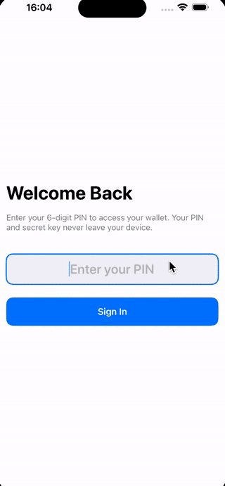

# SwiftBasicPay

SwiftBasicPay is a demo payment app for the Stellar Network demonstrating how Swift developers can build a Stellar payment application using the [Stellar Wallet SDK for Swift](https://github.com/Soneso/stellar-wallet-sdk-ios) and the [Stellar iOS SDK](https://github.com/Soneso/stellar-ios-mac-sdk).


## Demo



*Sending a path payment with SwiftBasicPay - from selection to confirmation in seconds*


## Features

### Wallet Functionality
- **Authentication**: PIN-based security
- **Account Management**: Stellar account creation and management
- **Asset Management**: Add/remove trust lines, asset overview
- **Payments**: Send and receive Stellar assets
- **Path Payments**: Cross-asset payments with automatic routing

### Anchor Integration
- Programatic deposits and withdrawals via anchors
- KYC compliance
- Interactive deposits/withdrawals with web integration

SwiftBasicPay integrates multiple Stellar Ecosystem Proposals (SEPs) through the wallet SDK:

- **[SEP-1](https://github.com/stellar/stellar-protocol/blob/master/ecosystem/sep-0001.md)**: Stellar TOML - Provides anchor metadata and service endpoints
- **[SEP-10](https://github.com/stellar/stellar-protocol/blob/master/ecosystem/sep-0010.md)**: Web Authentication - Proves account ownership to anchors
- **[SEP-6](https://github.com/stellar/stellar-protocol/blob/master/ecosystem/sep-0006.md)**: Deposit/Withdrawal API - Traditional REST-based transfer protocol
- **[SEP-9](https://github.com/stellar/stellar-protocol/blob/master/ecosystem/sep-0009.md)**: Standard KYC Fields - Defines standard customer information fields
- **[SEP-12](https://github.com/stellar/stellar-protocol/blob/master/ecosystem/sep-0012.md)**: KYC API - Customer information collection and verification
- **[SEP-24](https://github.com/stellar/stellar-protocol/blob/master/ecosystem/sep-0024.md)**: Hosted Deposit/Withdrawal - Interactive web-based transfers

## SDKs Used

- **[Stellar Wallet SDK](https://github.com/Soneso/stellar-wallet-sdk-ios)**: High-level operations for wallet functionality
- **[Stellar iOS SDK](https://github.com/Soneso/stellar-ios-mac-sdk)**: Core iOS Stellar SDK

## Architecture

```
┌─────────────────────────────────────┐
│     SwiftUI Views (@Environment)    │
└──────────────┬──────────────────────┘
               ↓
┌─────────────────────────────────────┐
│   DashboardData (@Observable)       │
│   ┌────────────────────────────┐    │
│   │ Domain Managers:           │    │
│   │ • AssetManager            │    │
│   │ • PaymentManager          │    │
│   │ • ContactManager          │    │
│   │ • KycManager              │    │
│   └────────────────────────────┘    │
└──────────────┬──────────────────────┘
               ↓
┌─────────────────────────────────────┐
│        Service Layer                │
│   • StellarService (SDK wrapper)    │
│   • AuthService (Authentication)    │
│   • SecureStorage (Keychain)        │
└──────────────┬──────────────────────┘
               ↓
┌─────────────────────────────────────┐
│         Stellar SDKs                │
│   • stellar-wallet-sdk              │
│   • stellar-ios-mac-sdk             │
└─────────────────────────────────────┘
```

### Core Components

- **DashboardData**: @Observable + @MainActor class for centralized state
- **DataState<T>**: Enum for async state management (.idle, .loading, .loaded, .error)
- **Domain Managers**: Specialized managers with caching and performance optimizations
- **Service Layer**: Abstraction of SDK functionality

## Installation

1. Clone the repository:
```bash
git clone https://github.com/Soneso/SwiftBasicPay.git
cd SwiftBasicPay
```

2. Open the project in Xcode:
```bash
open SwiftBasicPay.xcodeproj
```

3. Build & Run:
   - Scheme: SwiftBasicPay
   - Destination: iPhone Simulator
   - iOS Deployment Target: 17.5+

## Project Structure

```
SwiftBasicPay/
├── Model/
│   └── DashboardData.swift      # Central state manager with domain managers
├── View/
│   ├── ContentView.swift        # Root navigation
│   ├── AuthView.swift           # Authentication UI
│   ├── Dashboard.swift          # Tab navigation
│   ├── Overview.swift           # Dashboard home
│   ├── PaymentsView.swift       # Payment features
│   ├── AssetsView.swift         # Asset management
│   ├── TransfersView.swift      # Anchor transfers (SEP-6/24)
│   └── [Additional Views]       # Settings, Contacts, KYC, etc.
├── services/
│   ├── StellarService.swift     # Stellar SDK wrapper
│   ├── AuthService.swift        # Authentication logic
│   └── SecureStorage.swift      # Keychain integration
├── common/
│   └── [Utilities]              # Errors, helpers, models
└── Assets.xcassets/             # App resources
```

## Learning Topics for Developers

This app demonstrates how to:

1. **Create Stellar Wallets**: Account generation, key management
2. **Implement Assets Management**: Add and remove trustlines to Stellar assets
3. **Implement Payments**: Simple and path payments
4. **Interact with Anchors**: SEP-1/10/6/12/24 integration
5. **Ensure Security**: Keychain, PIN authentication, secure communication
6. **Optimize Performance**: Caching, parallel requests, lazy loading

## Tutorial

A comprehensive tutorial walking through the development of this Stellar payment app is available:

- **Tutorial**: [tutorial](https://github.com/Soneso/SwiftBasicPay/tree/main/tutorial)

The tutorial covers secure data storage, authentication, account creation, assets management, payments, path payments, and anchor integration with step-by-step explanations of how the Stellar SDKs are used.


## License

This project is licensed under the Apache 2.0 License - see [LICENSE](LICENSE) for details.

## Support

For questions or issues:
- Create an [issue](https://github.com/Soneso/SwiftBasicPay/issues)
- Consult the [Stellar Wallet SDK Documentation](https://github.com/Soneso/stellar-swift-wallet-sdk)
- Consult the [Stellar Documentation](https://developers.stellar.org)

## Contributing

Contributions are welcome! Please create a pull request with a clear description of your changes.

---

Developed by [Soneso](https://soneso.com) as a reference implementation for the Stellar community.