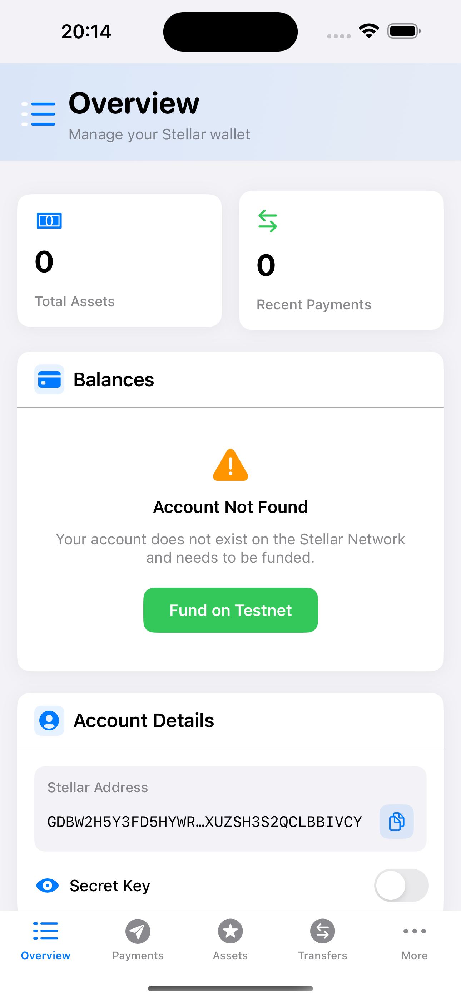
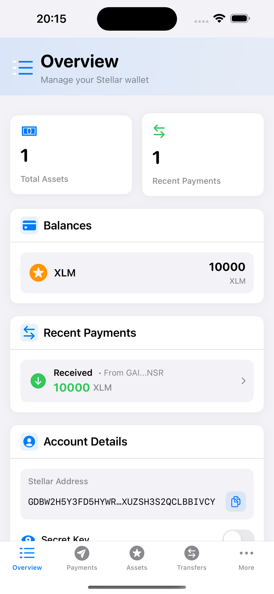

# Account Creation

Accounts are the central data structure in Stellar and can only exist with a valid keypair (a public and secret key) and the required minimum balance of XLM.
Read more in the [Stellar docs: Accounts section](https://developers.stellar.org/docs/learn/fundamentals/stellar-data-structures/accounts).

After signup, the user get's redirected to the dashboard home page.

## Fund account

The [`BalancesBox`](https://github.com/Soneso/SwiftBasicPay/blob/main/SwiftBasicPay/View/BalancesBox.swift) UI shows that the uses account is not yet funded.



If the user presses the `Fund on Testnet` button, we request the Stellar Testnet's `Friendbot` to fund the account by using the [`StellarService`](https://github.com/Soneso/SwiftBasicPay/blob/main/SwiftBasicPay/services/StellarService.swift) class.

```swift
try await StellarService.fundTestnetAccount(address: dashboardData.userAddress)
```

[`StellarService.swift`](https://github.com/Soneso/SwiftBasicPay/blob/main/SwiftBasicPay/services/StellarService.swift) uses the wallet sdk to fund the testnet account:

```swift
/// Funds the user account on the Stellar Test Network by using Friendbot.
///
/// - Parameters:
///   - address: Stellar account id (G...) to be funded. E.g. the user's stellar account id
///
public static func fundTestnetAccount(address:String) async throws {
    return try await wallet.stellar.fundTestNetAccount(address: address)
}
```

## Update Dashboard data

After the account has been funded, our instance of `DashboardData` must reload the users data, so that the app views can automatically update their state. 

In [`BalancesBox.swift`](https://github.com/Soneso/SwiftBasicPay/blob/main/SwiftBasicPay/View/BalancesBox.swift):

```swift
try await StellarService.fundTestnetAccount(address: dashboardData.userAddress)

await dashboardData.fetchStellarData()
```

After the user's data is loaded from the Stellar Network the views are automatically updated. E.g. [`Overview.swift`](https://github.com/Soneso/SwiftBasicPay/blob/main/SwiftBasicPay/View/Overview.swift):



When you're ready to move your application to Pubnet, accounts will need to be funded with real XLM. This is something the application can cover itself by depositing XLM into the user's account, with the use of [sponsored reserves](https://developers.stellar.org/docs/learn/encyclopedia/transactions-specialized/sponsored-reserves), or the user can cover the required balance with their own XLM. See also [sponsoring transactions with the wallet sdk](https://developers.stellar.org/docs/building-apps/wallet/stellar#sponsoring-transactions).


## Next

Continue with [Manage trust](manage_trust.md)
