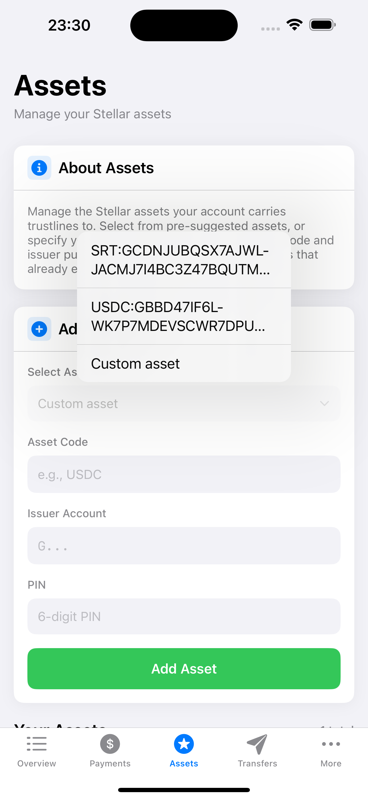
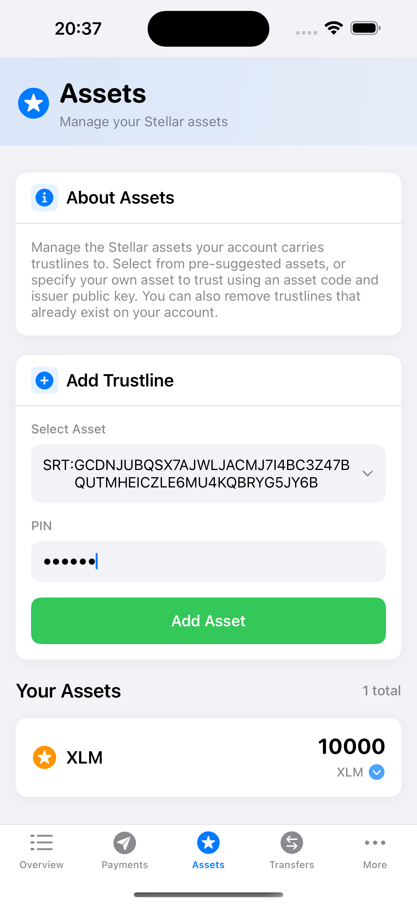
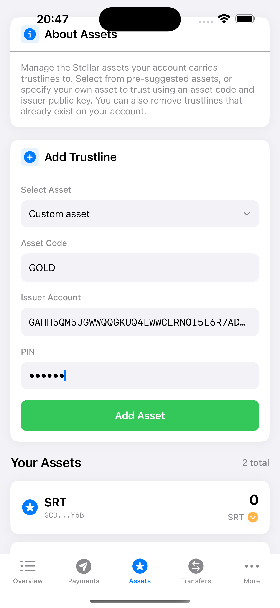
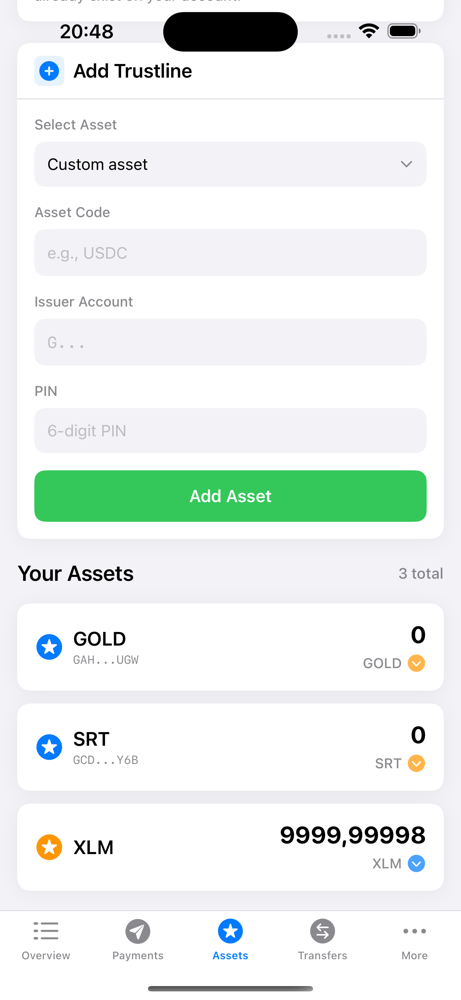
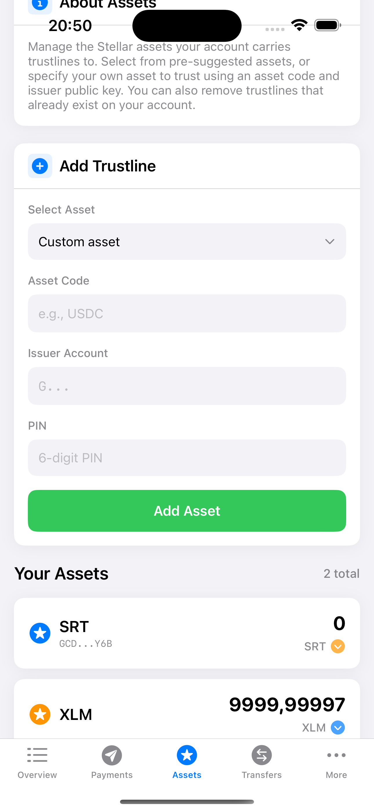

# Manage trust

For an account to hold and trade assets other than XLM, it must establish a [trustline](https://developers.stellar.org/docs/learn/fundamentals/stellar-data-structures/accounts#trustlines) with the issuing account of that particular asset. Each trustline increases the account’s [base reserve](https://developers.stellar.org/docs/learn/fundamentals/stellar-data-structures/accounts#base-reserves-and-subentries) by 0.5 XLM, which means the account will have to hold more XLM in its minimum balance.

## Adding an asset

First, we’ll have the user create a trustline for an asset by navigating to the Assets tab. 


Then select an asset from the dropdown. The dropdown includes two predefined assets. 
This are assets provided by the Stellar Test Anchor. Additionally, one can select `Custom asset` to insert the asset data.




For now, let's select the predefined asset `SRT`. As soon as selected, the page shows the pincode input field:



The user must enter their pincode, so that we can request and decrypt their secret key from the [secure storage](secure_data_storage.md).
We will need it to sign the transaction. After entering the pincode and pressing the `Submit` button, the app builds the transaction and sends it to the Stellar Network.


As soon as the trustline has been established, the asset appears in list of existing balances:


The user's account now trusts the `SRT` asset, can hold it and trade it. We can also see that the `XLM` balance has been reduced. This is because 
all Stellar transactions require a small fee to make it to the ledger. Read more in the Stellar docs [Fees section](https://developers.stellar.org/docs/learn/fundamentals/fees-resource-limits-metering).

If we switch back to the Overview, we can also see that the Balances Box now displays the new trusted asset:


### Code implementation

Now let's have a look how this flow has been implemented. You can find the source code in [`AssetsView.swift`](https://github.com/Soneso/SwiftBasicPay/blob/main/SwiftBasicPay/View/AssetsView.swift)

First, we load the assets that the user already trusts, because we do not want to add them to the dropdown.

```swift
var userAssets: [AssetInfo] {
    dashboardData.userAssets
}

var assetsToAdd:[IssuedAssetId] {
    var result = StellarService.testnetAssets()
    for asset in userAssets {
        result = result.filter {$0.id != asset.id}
    }
    return result
}
```

The user's assets were previously loaded from the Stellar Network using the wallet sdk and saved in [Dashboard Data](dashboard_data.md).

See [`Overview.swift`](https://github.com/Soneso/SwiftBasicPay/blob/main/SwiftBasicPay/View/Overview.swift):
```swift
.onAppear() {
    Task {
        await dashboardData.fetchStellarData()
    }
}
```

Now let's go back to our [`AssetsView.swift`](https://github.com/Soneso/SwiftBasicPay/blob/main/SwiftBasicPay/View/AssetsView.swift). 

The Picker is filled with the assets that can be added (the two predefined, known assets of the Stellar Test Anchor: `SRT` and `USDC`) and additionally we have an item for custom assets, so that the user can specify the asset data (code, issuer) for any other asset they would like to add:

```swift
Picker("select asset", selection: $selectedAsset) {
    ForEach(assetsToAdd, id: \.self) { asset in
        Text("\(asset.id)").italic().foregroundColor(.black).tag(asset.id)
    }
    Text(AssetsView.customAssetItem).italic().foregroundColor(.black).tag(AssetsView.customAssetItem)
}
```

Our dropdown is ready:


If the user selects an asset from the dropdown, they must next enter their pin so that we can sign the Stellar transaction to be submitted to the Stellar Network for adding the asset.


After the user inserts their pin and press the `Submit` button we need to build, sign and submit the transaction to Stellar by using the wallet sdk:


```swift
private func addAsset() async {
    //...
    
    let assetToAdd = try await getSelectedAsset()
    let userKeyPair = try authService.userKeyPair(pin: self.pin)
    let success = try await StellarService.addAssetSupport(asset: assetToAdd, userKeyPair: userKeyPair)
    
    //...
}
```

First let's have a look to `getSelectedAsset()`:

```swift
private func getSelectedAsset() async throws -> IssuedAssetId {
    if selectedAsset != AssetsView.customAssetItem {
        guard let selectedIssuedAsset = assetsToAdd.filter({$0.id == selectedAsset}).first else {
            throw DemoError.runtimeError("Error finding selected asset")
        }
        return selectedIssuedAsset
    } else {
        do {
            // validate format
            let selectedIssuedAsset = try IssuedAssetId(code: assetCode, issuer: assetIssuer)
            // check if issuer exists
            let issuerExists = try await StellarService.accountExists(address: assetIssuer)
            if (!issuerExists) {
                throw DemoError.runtimeError("Asset issuer not found on the Stellar Network")
            }
            return selectedIssuedAsset
        } catch {
            throw DemoError.runtimeError(error.localizedDescription)
        }
    }
}
```

If the user selected a predefined asset from the list, we just return it. If the user entered the data for a custom asset (asset code and asset issuer), we need to validate the input first. The validation of the format is automatically done by the wallet sdk when we initialize the `IssuedAssetId` object that we need to return. If invalid, it will throw an exception. 

Next we are going to check if the given asset issuer (account id) exists on the Stellar Network. If the account does not exist, our transaction will fail. To check if the issuer account exists, we use our [`StellarService`](https://github.com/Soneso/SwiftBasicPay/blob/main/SwiftBasicPay/services/StellarService.swift) function `accountExists`:

```swift
/// Checks if an account for the given address (account id) exists on the Stellar Network.
/// 
/// - Parameters:
///   - address: Stellar account id (G...) to check.
///
public static func accountExists(address:String) async throws -> Bool {
    return try await wallet.stellar.account.accountExists(accountAddress: address)
}
``` 

The function uses the wallet sdk to check if the account exists.

Now that we know, that the issuer account exists, we can return the created `IssuedAssetId` object containing the valid asset data.

```swift
let userKeyPair = try authService.userKeyPair(pin: self.pin)
```

To get the user's signing keypair we use our `AuthService` (see [authentication]((authentication.md))). If the provided pincode is valid, we receive the keypair and can pass it to the  `StellarService` function `addAssetSupport` together with the selected asset, to create the trustline.

```swift
let success = try await StellarService.addAssetSupport(asset: assetToAdd, userKeyPair: userKeyPair)
```

In [`StellarService`](https://github.com/Soneso/SwiftBasicPay/blob/main/SwiftBasicPay/services/StellarService.swift):

```swift
/// Adds a trust line by using the wallet sdk, so that the user can hold the given asset. Requires the user's signing keypair to
/// sign the transaction before sending it to the Stellar Network. Returns true on success.
///
/// - Parameters:
///   - asset: The asset for which the trustline should be added
///   - userKeyPair: The user's signing keypair needed to sign the transaction
///
public static func addAssetSupport(asset:IssuedAssetId, userKeyPair:SigningKeyPair) async throws -> Bool {
    let stellar = wallet.stellar
    let txBuilder = try await stellar.transaction(sourceAddress: userKeyPair)
    let tx = try txBuilder.addAssetSupport(asset: asset).build()
    stellar.sign(tx: tx, keyPair: userKeyPair)
    return try await stellar.submitTransaction(signedTransaction: tx)
}
```

The wallet sdk is used to compose, sign and submit the signed transaction to the Stellar Network. 

After submitting, we let our DashboardData instance reload so that our views get updated.
```swift
await dashboardData.fetchUserAssets()
```

As soon as the data has been reloaded we can see the new trustline represented by an assest in our balances box:


## Adding a custom asset

We can use [Stellar Lab](https://laboratory.stellar.org/#?network=test) to create a new issuer account on the Stellar Test Network first. The new issuer will emit our custom asset for this tutorial. 

Navigate to [Stellar Lab](https://laboratory.stellar.org/#?network=test) in your browser:


1. Select the `test` Network
2. Select the `Create Account Keypair` menu item
3. Press the `Generate keypair` button
4. Copy the displayed Public and Secret Key values and save them for later.
5. Press the `Fund account with Friendbot` button and wait until the account is funded.


Now we have a new funded account, that is our `issuer account`. In this case the `account id` (also called `address` or `public key`) is

`GAHH5QM5JGWWQQGKUQ4LWWCERNOI5E6R7ADG3S4KY6LYZXHBAMYEUUGW`

and the `secret key` (also called `secret seed`) is:

`SASFCFEC24GLOHT6FSOG7ENS4K6ZAPKL6ZROXB3YSUQ5PLTQ2TAUXUIG`

Now that we have an issuer account for testing, let's add a trustline to a custom asset issued by this account using our app. To do so,
we select `Custom asset` from the assets dropdown on the assets page:


As soon as selected, the `Custom Asset` the input fields for entering the asset data appear. Here we have to insert the asset code and the issuer account id. Issued assets are defined by the asset code (the asset’s identifying code), that can have max. 12 characters and the asset issuer id. Please read more about assets in the [Stellar Docs Assets](https://developers.stellar.org/docs/learn/fundamentals/stellar-data-structures/assets) section.

As we are the issuers of the asset, we can call it however we want. Let's name it `GOLD`. `GOLD` is our asset code. The issuer account id is the public key that we generated before. Let's insert them into the `Custom Asset` dialog form:



Also enter the pincode to add the trustline. After submitting, the asset appears in our list of existing balances:



The implementaion is the same as above and the source code can be found in [AssetsView.swift](https://github.com/Soneso/SwiftBasicPay/blob/main/SwiftBasicPay/View/AssetsView.swift).

Next, let send some `GOLD` from the issuer account to our user's account. To do so we use the [Stellar Laoboratory](https://laboratory.stellar.org/#?network=test) again.


1. Select the `test` Network
2. Select the `Buld Transaction` menu item
3. Paste the issuer account id into the `Source Account` field. (ours is `GAHH5QM5JGWWQQGKUQ4LWWCERNOI5E6R7ADG3S4KY6LYZXHBAMYEUUGW`)
4. Press the `Fetch next sequence` button to get the sequence number for the transaction.

Scroll down:


5. Select `Payment` as an operation type.
6. Insert the user account id as a destination for the payment. You can find it in the overview tab of the app on the `My Data` box:


7. Select `Alphanumeric 4` asset.
8. Insert the asset code (`GOLD`) and our issuer account id (`GAHH5QM5JGWWQQGKUQ4LWWCERNOI5E6R7ADG3S4KY6LYZXHBAMYEUUGW`) to identify the asset.
9. Insert the amount of `GOLD` you would like to receive (e.g. 300)
10. Press `Sign in Transaction Signer` to sign and later submit the transaction to the Stellar Test Network.

Next page:


11. Insert the issuer account secret key to sign the transaction and then press "Sign". (ours is `SASFCFEC24GLOHT6FSOG7ENS4K6ZAPKL6ZROXB3YSUQ5PLTQ2TAUXUIG`)
12. Press the `Submit transaction` button to submit the signed transaction to the Stellar Test Network.
13. on the next screen press `Submit transaction` again

After the transaction has been submitted, we should have received the `GOLD` asset. Currently the app does not refresh automatically, 
so we must switch from some other tab to the `Overview` tab to update. For example, switch to the `Assets` tab first and then back to the `Overview`:


## Removing an asset

Trustlines can only be removed if the user holds a zero balance of the corresponding asset. For example, we hold 0 `SRT` which means that we can remove that trustline but we hold 300 `GOLD`and therefore we cannot remove the `GOLD` trustline.


To remove the trustline, the user presses the `Trash` icon button. As soon as pressed, the [`PinSheet`](https://github.com/Soneso/SwiftBasicPay/blob/main/SwiftBasicPay/View/PinSheet.swift) is displayed, so that the user can insert their pincode needed to decrypt their secret key that we need to sign the transaction.


After entering the pincode, the app decrypts the secret key, builds, signs and submits the transaction to the Stellar Network. On success, the trustline has been removed and the UI has been updated:




### Code implementation

The implementation is similar to the above shown implementation for adding an asset. It can be found in [AssetsView.swift](https://github.com/Soneso/SwiftBasicPay/blob/main/SwiftBasicPay/View/AssetsView.swift).

This time we call the `StellarService` function `removeAssetSupport` to remove the trustline: 

```swift
let success = try await StellarService.removeAssetSupport(asset: assetToRemove, userKeyPair: signingKey)
```

In [`StellarService`](https://github.com/Soneso/SwiftBasicPay/blob/main/SwiftBasicPay/services/StellarService.swift):

```swift
/// Removes a trust line by using the wallet sdk, so that the user can not hold the given asset any more.
/// It only works if the user has a balance of 0 for the given asset. Requires the user's signing keypair to
/// sign the transaction before sending it to the Stellar Network. Returns true on success.
///
/// - Parameters:
///   - asset: The asset to remove the trustline for
///   - userKeyPair: The user's signing keypair needed to sign the transaction
///
public static func removeAssetSupport(asset:IssuedAssetId, userKeyPair:SigningKeyPair)  async throws -> Bool {
    let stellar = wallet.stellar
    let txBuilder = try await stellar.transaction(sourceAddress: userKeyPair)
    let tx = try txBuilder.removeAssetSupport(asset: asset).build()
    stellar.sign(tx: tx, keyPair: userKeyPair)
    return try await stellar.submitTransaction(signedTransaction: tx)
}
```

It uses the wallet sdk to build, sign and submit the transaction to the Stellar Test Network. 

After that, we let our `DashboardData` instance reload the user's assets and the UI gets updated.

```swift
await dashboardData.fetchUserAssets()
```

# Next

Continue with [Payment](payment.md).


