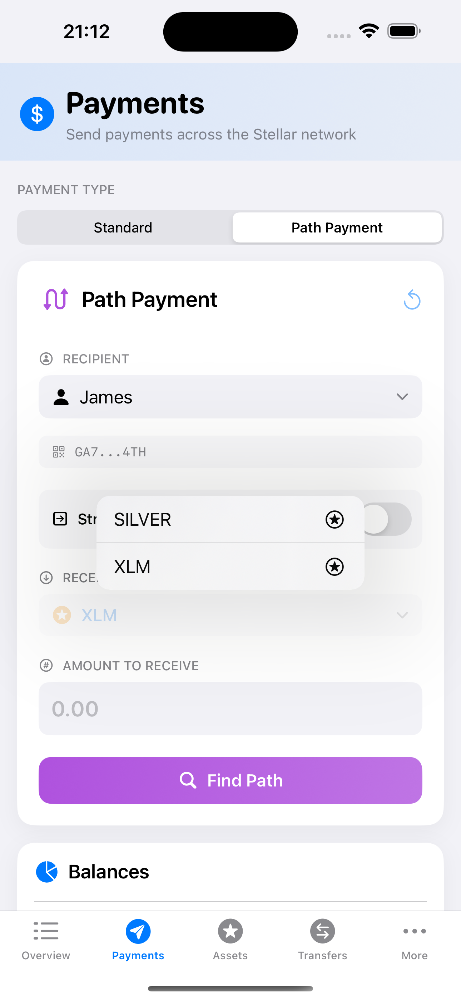

# Path payment

A path payment is where the asset sent can be different from the asset received. There are two possible path payment operations: 1) `path_payment_strict_send`, which allows the user to specify the amount of the asset to send, and 2) `path_payment_strict_receive`, which allows the user to specify the amount of the asset received. Read more in the Stellar's [Path Payments Encyclopedia Entry](https://developers.stellar.org/docs/learn/encyclopedia/transactions-specialized/path-payments).

With SwiftBasicPay, the user sends a path payment by navigating to the `Payments tab`, where they can select the `Send and Receive different Assets` toggle. Then they can either select a user from their contacts or input the public key of a destination address. They then determine whether they want to specify the asset sent or received. Finally, they select the asset sent and the asset received and the amounts.


## Strict send

Allows a user to specify the amount of the asset to send. The amount received will vary based on offers in the order books and/or liquidity pools.


## Strict receive

Allows a user to specify the amount of the asset received. The amount sent will vary based on the offers in the order books/liquidity pools.



## Preparing data for our test

In order to test the path payment functionality, we will first prepare the test data for it. We will use the [Stellar Lab](https://laboratory.stellar.org/#?network=test) to do so. We have already used it the chapter [manage tust](manage_trust.md) to make our user account trust the asset `GOLD` and transfer some `GOLD` to our user. 

### Create recipient account

Next, we will create a new account that will trust the asset `SILVER` of the same issuer as in the [manage tust](manage_trust.md) chapter and transfer some `SILVER` to the new user. We will add his Stellar address to our contacts and use it as the recipient account. We will call the new contact `James`.

First let's create the new account for `James` and fund it on testnet:


Next, let's trust `SILVER` from the issuer `GAHH5QM5JGWWQQGKUQ4LWWCERNOI5E6R7ADG3S4KY6LYZXHBAMYEUUGW`:


Now James can receive `SILVER:GAHH5QM5JGWWQQGKUQ4LWWCERNOI5E6R7ADG3S4KY6LYZXHBAMYEUUGW`

### Add recipient account to contacts

On the contracts page, we can add the new recipient account to our list of contacts by entering his name (`James`) and his Stellar address.


This will add the recipient to or list of contracts by storing the data in the secure storage and then update our instance of `DashboardData`. The code can be found in [`ContactsView.swift`](https://github.com/Soneso/SwiftBasicPay/blob/main/SwiftBasicPay/View/ContactsView.swift).

### Create trading accounts

To be able to send path payments we need offers in the order book or in liquidity pools. For our test, we will create two offers in the order book that can be used to trade `GOLD` against `SILVER`. Like in the steps before, we first create and fund two new accounts. Then, we let the first one trust `GOLD` and `COPPER` from our issuer account and the second one trust `COPPER` and `SILVER`.

Change trust for the first trader (`GOLD` and `COPPER`):


Change trust for the second trader (`COPPER` and `SILVER`):


Next, lets fund the trader accounts, so that we can create the offers. Issuer sends 10.000 `COPPER` to the first trader account and 1.000 `SILVER` to the second trader account:


Now, that our first trading account holds `COPPER`, we can create a sell offer by using its address as a source account:


The first trader account sells `COPPER` for `GOLD` at a price of 0.01 units of `GOLD` for 1 unit of `COPPER`.

The second trading account sells `SILVER` for `COPPER`:


They sell `SILVER` for `COPPER` at a price of 10 units of `COPPER` for 1 unit of `SILVER`.

### Summary

Now we have following test data:

1. User account trusts `GOLD` and has a balanace of 300 `GOLD`.
2. Recipient account: `James` created and added to the contacts. `James` trusts and therefore can receive `SILVER`.
3. First trader account trusts `GOLD` and `COPPER` and sells `COPPER` for `GOLD` at a price of 0.01 units of `GOLD` for 1 unit of `COPPER`.
4. Second trader account trusts `COPPER` and `SILVER` and sells `SILVER` for `COPPER` at a price of 10 units of `COPPER` for 1 unit of `SILVER`.

What we want to achieve is that our user account sends `GOLD` and the recipient account receives `SILVER`. This is now possible by using the traders offers in the order book via the following payment path:

`GOLD` -> `COPPER` -> `SILVER` 


## Path Payment UI

Now, that the test data is prepared, let's have a look to the path payment UI. If the user activates the `Send and Receive Different Assets toggle` the Payments Tab ([`PaymentsView.swift`](https://github.com/Soneso/SwiftBasicPay/blob/main/SwiftBasicPay/View/PaymentsView.swift)) the `Send path payment` box will be displayed ([`SendPathPaymentBox.swift`](https://github.com/Soneso/SwiftBasicPay/blob/main/SwiftBasicPay/View/SendPathPaymentBox.swift)).


Next, let's select `James` as a recipient.


As soon as a contact is selected or another recipient address is entered, the list of the recipient's Stellar assets (`destinationAssets`) is loaded from the Stellar Test Network. We need it to be able to display the recipient assets dropdown later.

```swift
private func loadPathPaymentDestinationAssets(destAccountId:String) async {
    state = PathPaymentBoxState.loadingDestinationAssets
    await recipientAssetsFetcher.fetchAssets(accountId: destAccountId)
    if let error =  recipientAssetsFetcher.error {
        switch error {
        case .accountNotFound(_):
            errorMessage = "The recipient account was not found on the Stellar Network. It needs to be funded first."
        case .fetchingError(_, let message):
            errorMessage = message
        }
        errorMessage = error.localizedDescription
        state = PathPaymentBoxState.loadingDestinationAssetsError
        return
    }
    
    state = PathPaymentBoxState.destinationAssetsLoaded
}
```

The [`AssetsFetcher`](https://github.com/Soneso/SwiftBasicPay/blob/main/SwiftBasicPay/common/AssetsFetcher.swift) uses our [`StellarService`](https://github.com/Soneso/SwiftBasicPay/blob/main/SwiftBasicPay/services/StellarService.swift) to load the assets.

```swift
let loadedAssets = try await StellarService.loadAssetsForAddress(address: accountId)
```


In [`StellarService.swift`](https://github.com/Soneso/SwiftBasicPay/blob/main/SwiftBasicPay/services/StellarService.swift):

```swift
/// Loads the assets for a given account specified by `address` from the Stellar Network by using the wallet sdk.
///
/// - Parameters:
///   - address: Stellar account id (G...). E.g. the user's stellar account id
///
public static func loadAssetsForAddress(address:String) async throws -> [AssetInfo] {
    var loadedAssets:[AssetInfo] = []
    let info = try await wallet.stellar.account.getInfo(accountAddress: address)
    for balance in info.balances {
        let asset = try StellarAssetId.fromAssetData(type: balance.assetType,
                                                     code: balance.assetCode,
                                                     issuerAccountId: balance.assetIssuer)
        let assetInfo = AssetInfo(asset: asset, balance: balance.balance)
        loadedAssets.append(assetInfo)
    }
    return loadedAssets
}
```

Depending on whether we have selected `strict send` or `strict receive`, we can now select the corresponding asset from the dropdown ([`SendPathPaymentBox.swift`](https://github.com/Soneso/SwiftBasicPay/blob/main/SwiftBasicPay/View/SendPathPaymentBox.swift)). 

```swift
if strictSend {
    Text("Send:").font(.subheadline)
    Picker("select asset to send", selection: $selectedAssetToSend) {
        ForEach(assetsThatCanBeSent, id: \.self) { asset in
            if let _ = asset.asset as? NativeAssetId {
                Text("XLM").italic().foregroundColor(.black).tag(asset.id)
            } else if let issuedAsset = asset.asset as? IssuedAssetId {
                Text("\(issuedAsset.code)").italic().foregroundColor(.black).tag(asset.id)
            }
        }
    }.frame(maxWidth: .infinity, alignment: .leading)
} else {
    Text("Receive:").font(.subheadline)
    Picker("select asset to receive", selection: $selectedAssetToReceive) {
        ForEach(assetsThatCanBeReceived, id: \.self) { asset in
            if let _ = asset.asset as? NativeAssetId {
                Text("XLM").italic().foregroundColor(.black).tag(asset.id)
            } else if let issuedAsset = asset.asset as? IssuedAssetId {
                Text("\(issuedAsset.code)").italic().foregroundColor(.black).tag(asset.id)
            }
        }
    }.frame(maxWidth: .infinity, alignment: .leading)
}
```

### Strict send

In the following, we use `strict send` so that the list of our user assets is displayed in the dropdown. 

Let's select `GOLD` as the asset we would like to send. 


As soon as we select the asset to send, we display the amount form, where the user can insert the amount that they want to send. It also shows the `Find path` button. Before sending a path payment we should first find the possible paths using the wallet sdk. It is important, because then we can see if a payment is possible and if multiple paths are available, we can let the user choose a path including the destination asset.

Let's insert 20 `GOLD` as the strict send amount and press the `Find path` button. The app will search for the possible payment paths and display the result. 

Because there is only one possible path in our case, we only show this one:


**Source code:**

```swift
var paths:[PaymentPath] = []
if strictSend {
    paths = try await StellarService.findStrictSendPaymentPath(sourceAsset: stellarAsset, sourceAmount: Decimal(amount), destinationAddress: recipientAccountId)
} else {
    paths = try await StellarService.findStrictReceivePaymentPath(sourceAddress: dashboardData.userAddress, destinationAsset: stellarAsset, destinationAmount: Decimal(amount))
}
```

In [`StellarService.swift`](https://github.com/Soneso/SwiftBasicPay/blob/main/SwiftBasicPay/services/StellarService.swift):

```swift
/// Searches for a strict send payment path by using the wallet sdk.
/// Requires the source asset, the source amount and the destination address of the recipient.
///
/// - Parameters:
///   - sourceAsset: The asset you want to send
///   - sourceAmount: The amount you want to send
///   - destinationAddress: Account id of the recipient
///
public static func findStrictSendPaymentPath(sourceAsset: StellarAssetId,
                                             sourceAmount:Decimal,
                                             destinationAddress:String) async throws -> [PaymentPath] {
    
    let stellar = wallet.stellar
    return try await stellar.findStrictSendPathForDestinationAddress(destinationAddress: destinationAddress,
                                                                     sourceAssetId: sourceAsset,
                                                                     sourceAmount: sourceAmount.description)
    
}
```

We use the wallet sdk to find the possible paths. As arguments we need the asset to be sent and amount, and also the address of the recipient.
The result is a list of possible paths, each stored in a `PaymentPath` object:

```swift
public class PaymentPath {
    public let sourceAmount:String
    public let sourceAsset:StellarAssetId
    public let destinationAmount: String
    public let destinationAsset: StellarAssetId
    public let path:[StellarAssetId]
 
 //...

}
```
If the list contains several entries, these can be made available to the user for selection. In our case, there is only one entry, which we have displayed immediately.

Now the user can enter their pincode, so that we can decrypt their signing key, sign the transaction and send the transaction to the Stellar Network.

As soon as the transaction has been successfully sent, we inform the user and they can see the payment in our `Recent payments` overview:

```swift
if strictSend {
    result = try await StellarService.strictSendPayment(
        sendAssetId: path.sourceAsset,
        sendAmount: Decimal(Double(path.sourceAmount)!),
        destinationAddress: recipientAccountId,
        destinationAssetId: path.destinationAsset,
        destinationMinAmount: Decimal(Double(path.destinationAmount)!),
        path: path.path,
        memo: memoToSend,
        userKeyPair: userKeyPair)
} 
else
{
 result = try await StellarService.strictReceivePayment(
    sendAssetId: path.sourceAsset,
    sendMaxAmount: Decimal(Double(path.sourceAmount)!),
    destinationAddress: recipientAccountId,
    destinationAssetId: path.destinationAsset,
    destinationAmount: Decimal(Double(path.destinationAmount)!),
    path: path.path,
    memo: memoToSend,
    userKeyPair: userKeyPair)
}
```

In [`StellarService.swift`](https://github.com/Soneso/SwiftBasicPay/blob/main/SwiftBasicPay/services/StellarService.swift):


```swift
/// Sends a strict send path payment by using the wallet sdk. Requires  the asset to send, strict amount to send and the account id of the recipient.
/// Also requires the the destination asset to be received, the minimum destination amount to be received and the assets path from the
/// payment path previously obtained by [findStrictSendPaymentPath]. Optionaly you can pass a text memo but the signing user's keypair is needed to sign
/// the transaction before submission. Returns true on success.
///
/// - Parameters:
///   - sendAssetId: The asset you want to send
///   - sendAmount: The amount you want to send
///   - destinationAddress: Account id of the recipient
///   - destinationAssetId: The asset you want the recipient to recieve
///   - destinationMinAmount: The min amount you want the recipient to recive
///   - path: the transaction path previously received from findStrictSendPaymentPath
///   - memo: Optional memo to attache to the transaction
///   - userKeyPair: The user's signing keypair for signing the transaction
///
///
public static func strictSendPayment(sendAssetId: StellarAssetId,
                                     sendAmount: Decimal,
                                     destinationAddress:String,
                                     destinationAssetId: StellarAssetId,
                                     destinationMinAmount:Decimal,
                                     path: [StellarAssetId],
                                     memo:String? = nil,
                                     userKeyPair: SigningKeyPair) async throws -> Bool {
    let stellar = wallet.stellar
    var txBuilder = try await stellar.transaction(sourceAddress: userKeyPair)
    txBuilder = txBuilder.strictSend(sendAssetId: sendAssetId,
                                     sendAmount: sendAmount,
                                     destinationAddress: destinationAddress,
                                     destinationAssetId: destinationAssetId,
                                     destinationMinAmount: destinationMinAmount,
                                     path: path)
    
    if let memo = memo {
        guard let memoObj = try Memo(text: memo) else {
            throw StellarServiceError.runtimeError("invalid argument 'memo' value: \(memo)")
        }
        txBuilder = txBuilder.setMemo(memo: memoObj)
    }
    let tx = try txBuilder.build()
    stellar.sign(tx: tx, keyPair: userKeyPair)
    return try await stellar.submitTransaction(signedTransaction: tx)
}
```

### Strict receive

Strict receive is similar to strict send described above, with the difference that the user must select the asset to be received.


We have selected `SILVER` as a destination asset from the dropdown of destination assets that `James` can receive. We must now enter the amount that `James` should (strict) receive. Next, we enter 100 `SILVER` and let the app search for a payment path path with the help of the wallet sdk.


The app found a payment path and displays it to the user.

In [`StellarService.swift`](https://github.com/Soneso/SwiftBasicPay/blob/main/SwiftBasicPay/services/StellarService.swift):

```swift
/// Searches for a strict receive payment path by using the wallet sdk. Requires the account id of the sending account,
/// the destination asset to be received and the destination amount to be recived by the recipient. It will search for all source assets hold by the user (sending account).
///
/// - Parameters:
///   - sourceAddress: The account id of the sending account
///   - destinationAsset: The asset the recipient should receive
///   - destinationAmount: The amount of the destination asset the recipient shopuld receive
///
public static func findStrictReceivePaymentPath(sourceAddress:String,
                                                destinationAsset:StellarAssetId,
                                                destinationAmount:Decimal) async throws -> [PaymentPath] {
    let stellar = wallet.stellar
    return try await stellar.findStrictReceivePathForSourceAddress(sourceAddress: sourceAddress,
                                                                   destinationAssetId: destinationAsset,
                                                                   destinationAmount: destinationAmount.description)
}
```

After the user enters their pincode and presses `Submit`, the transaction is prepared and sent to the Stellar Network.


In [`StellarService.swift`](https://github.com/Soneso/SwiftBasicPay/blob/main/SwiftBasicPay/services/StellarService.swift):

```swift
/// Sends a strict receive path payment by using the wallet sdk. Requires  the asset to send, maximum amount to send and the account id of the recipient.
/// Also requires the the destination asset to be received, the destination amount to be received and the assets path from the
/// payment path previously obtained by [findStrictReceivePaymentPath]. Optionaly you can pass a text memo but the signing user's keypair is needed to sign
/// the transaction before submission. Returns true on success.
///
/// - Parameters:
///   - sendAssetId: The asset you want to send
///   - sendMaxAmount: The maximal amount you want to send
///   - destinationAddress: Account id of the recipient
///   - destinationAssetId: The asset you want the recipient to recieve
///   - destinationAmount: The amount you want the recipient to recive
///   - path: the transaction path previously received from findStrictSendPaymentPath
///   - memo: Optional memo to attache to the transaction
///   - userKeyPair: The user's signing keypair for signing the transaction
///
///
public static func strictReceivePayment(sendAssetId: StellarAssetId,
                                        sendMaxAmount: Decimal,
                                        destinationAddress:String,
                                        destinationAssetId: StellarAssetId,
                                        destinationAmount:Decimal,
                                        path: [StellarAssetId],
                                        memo:String? = nil,
                                        userKeyPair: SigningKeyPair) async throws -> Bool {
    let stellar = wallet.stellar
    var txBuilder = try await stellar.transaction(sourceAddress: userKeyPair)
    txBuilder = txBuilder.strictReceive(sendAssetId: sendAssetId,
                                        destinationAddress: destinationAddress,
                                        destinationAssetId: destinationAssetId,
                                        destinationAmount: destinationAmount,
                                        sendMaxAmount: sendMaxAmount,
                                        path: path)
    if let memo = memo {
        guard let memoObj = try Memo(text: memo) else {
            throw StellarServiceError.runtimeError("invalid argument 'memo' value: \(memo)")
        }
        txBuilder = txBuilder.setMemo(memo: memoObj)
    }
    let tx = try txBuilder.build()
    stellar.sign(tx: tx, keyPair: userKeyPair)
    return try await stellar.submitTransaction(signedTransaction: tx)
    
}
```

As soon as the transaction has been successfully sent, we inform the user and they can see the payment in our `Recent payments` overview:


# Next

Continue with Anchor integration (todo).
