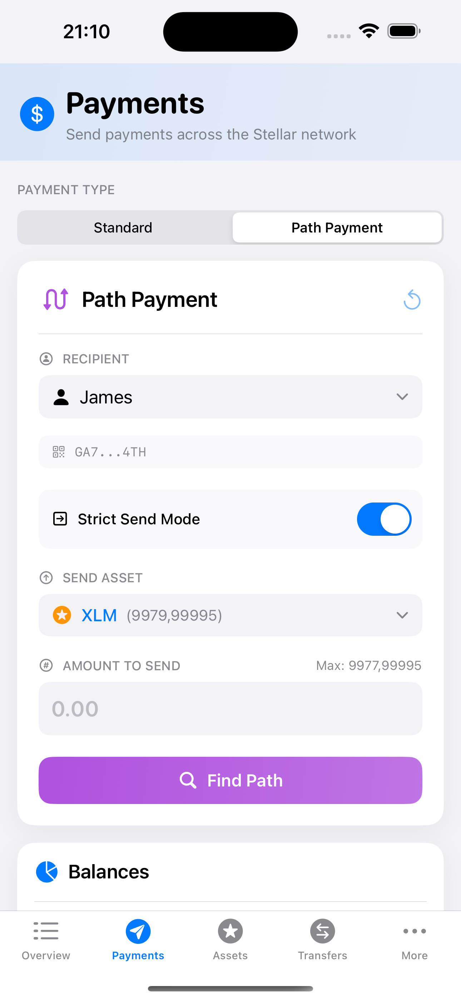
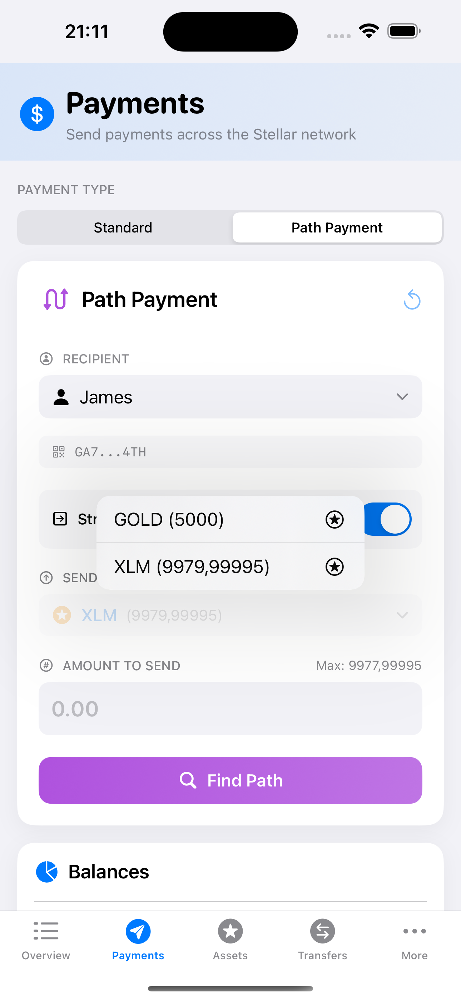
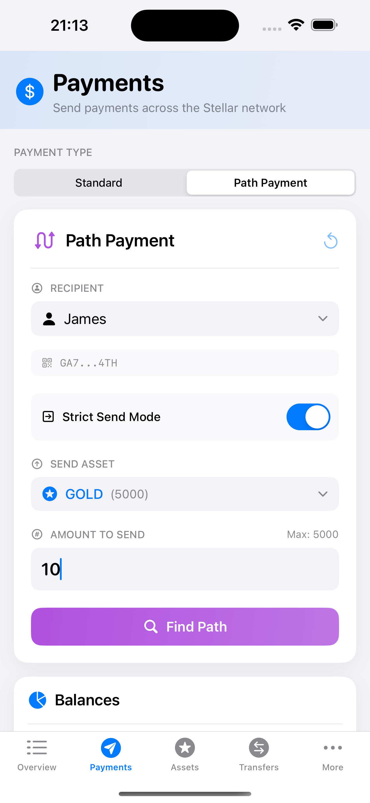
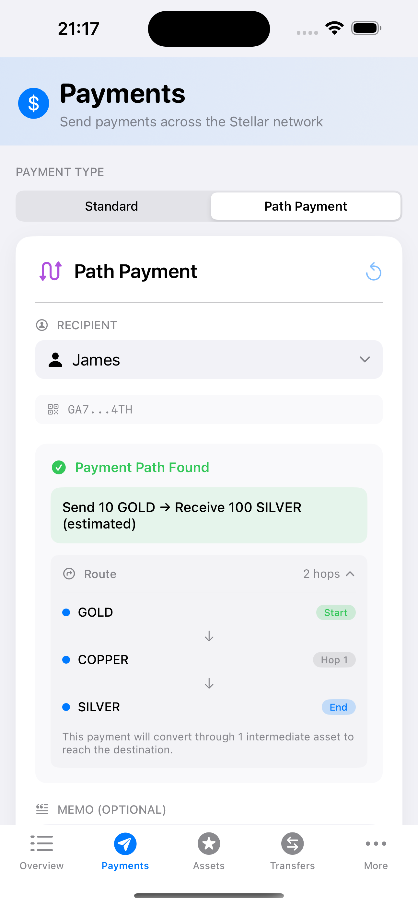
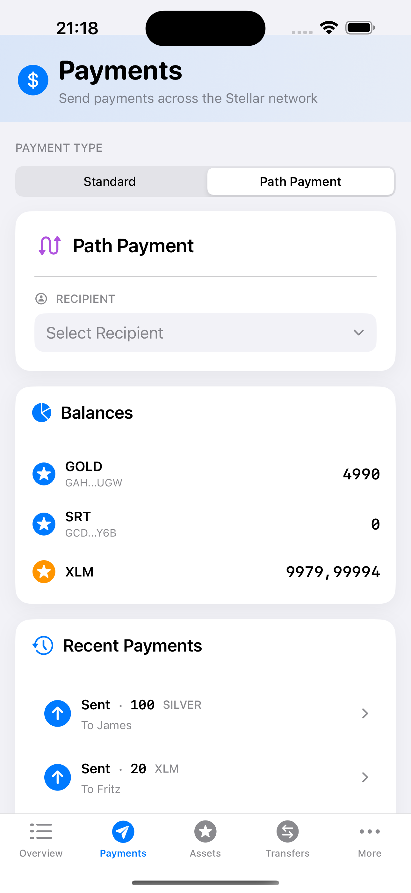

# Path Payment

Path payments enable cross-asset transactions where the asset sent differs from the asset received. Stellar supports two modes: `strict_send` (specify exact send amount) and `strict_receive` (specify exact receive amount). Read more in Stellar's [Path Payments Encyclopedia Entry](https://developers.stellar.org/docs/learn/encyclopedia/transactions-specialized/path-payments).

## Path Payment Architecture

The [`SendPathPaymentBox`](https://github.com/Soneso/SwiftBasicPay/blob/main/SwiftBasicPay/View/SendPathPaymentBox.swift) provides comprehensive path payment functionality:

```swift
@Observable
@MainActor
final class SendPathPaymentViewModel {
    // Form State
    var selectedAssetToSend = "native"
    var selectedAssetToReceive = "native"
    var selectedRecipient = "Select recipient"
    var recipientAccountId = ""
    var pin = ""
    var amountToSend = ""
    var memoToSend = ""
    var strictSend = true
    
    // UI State
    var state: PathPaymentState = .initial
    var errorMessage: String?
    var showSuccessToast = false
    var toastMessage = ""
    var selectedPath: PaymentPath?
    
    // Validation State
    var recipientError: String?
    var amountError: String?
    var pinError: String?
    var pathError: String?
    
    // Assets
    var recipientAssets: [AssetInfo] = []
    
    enum PathPaymentState: Int {
        case initial = 0
        case otherRecipientSelected = 1
        case loadingDestinationAssets = 2
        case destinationAssetsLoaded = 3
        case findingPath = 4
        case pathFound = 5
        case sendingPayment = 6
    }
}
```

## Payment Mode Selection

### Strict Send vs Strict Receive



```swift
HStack {
    Label("Strict Send Mode", systemImage: "arrow.right.square")
        .font(.system(size: 14, weight: .medium))
    
    Spacer()
    
    Toggle("", isOn: Binding(
        get: { viewModel.strictSend },
        set: { newValue in
            viewModel.handleStrictModeChange(newValue)
        }
    ))
    .labelsHidden()
}
.padding(12)
.background(Color(.systemGray6).opacity(0.5))
.cornerRadius(10)
```

## Strict Send Flow

### Selecting Asset to Send



When in strict send mode, users select from their owned assets:

```swift
// Send Asset Picker (when in strict send mode)
VStack(alignment: .leading, spacing: 8) {
    Label("Send Asset", systemImage: "arrow.up.circle")
        .font(.system(size: 12, weight: .medium))
        .foregroundColor(.secondary)
        .textCase(.uppercase)
    
    Menu {
        ForEach(dashboardData.userAssets.filter { Double($0.balance) ?? 0 > 0 }, id: \.id) { asset in
            Button(action: { viewModel.selectedAssetToSend = asset.id }) {
                Label {
                    Text("\(asset.code) (\(asset.formattedBalance))")
                } icon: {
                    Image(systemName: "star.circle")
                }
            }
        }
    } label: {
        HStack {
            if let asset = dashboardData.userAssets.first(where: { $0.id == viewModel.selectedAssetToSend }) {
                Image(systemName: "star.circle.fill")
                    .foregroundStyle(asset.id == "native" ? .orange : .blue)
                
                Text(asset.code)
                    .font(.system(size: 16, weight: .medium))
                
                Text("(\(asset.formattedBalance))")
                    .font(.system(size: 14))
                    .foregroundColor(.secondary)
            }
            
            Spacer()
            
            Image(systemName: "chevron.down")
                .font(.system(size: 12, weight: .semibold))
                .foregroundColor(.secondary)
        }
        .padding(.horizontal, 12)
        .padding(.vertical, 10)
        .background(Color(.systemGray6))
        .cornerRadius(10)
    }
}
```

## Strict Receive Flow

### Selecting Asset to Receive


In strict receive mode, users select from recipient's trusted assets:

```swift
// Receive Asset Picker (when in strict receive mode)
VStack(alignment: .leading, spacing: 8) {
    Label("Receive Asset", systemImage: "arrow.down.circle")
        .font(.system(size: 12, weight: .medium))
        .foregroundColor(.secondary)
        .textCase(.uppercase)
    
    Menu {
        ForEach(viewModel.recipientAssets, id: \.id) { asset in
            Button(action: { 
                viewModel.selectedAssetToReceive = asset.id 
                viewModel.selectedPath = nil
                viewModel.pathError = nil
            }) {
                Label {
                    Text(asset.code)
                } icon: {
                    Image(systemName: "star.circle")
                }
            }
        }
    } label: {
        HStack {
            if let asset = viewModel.recipientAssets.first(where: { $0.id == viewModel.selectedAssetToReceive }) {
                Image(systemName: "star.circle.fill")
                    .foregroundStyle(asset.id == "native" ? .orange : .blue)
                
                Text(asset.code)
                    .font(.system(size: 16, weight: .medium))
            } else {
                Text("Select Asset")
                    .font(.system(size: 16))
                    .foregroundColor(.secondary)
            }
            
            Spacer()
            
            Image(systemName: "chevron.down")
                .font(.system(size: 12, weight: .semibold))
                .foregroundColor(.secondary)
        }
        .padding(.horizontal, 12)
        .padding(.vertical, 10)
        .background(Color(.systemGray6))
        .cornerRadius(10)
    }
}
```

## Loading Recipient Assets

When a recipient is selected, their trusted assets are loaded:

```swift
private func validateAndLoadRecipientAssets() async {
    state = .loadingDestinationAssets
    
    do {
        let exists = try await StellarService.accountExists(address: recipientAccountId)
        if !exists {
            recipientError = "Account not found on Stellar Network. It needs to be funded first."
            state = .otherRecipientSelected
            return
        }
        
        // Load recipient assets directly
        recipientAssets = try await StellarService.loadAssetsForAddress(address: recipientAccountId)
        
        state = .destinationAssetsLoaded
        
        // Set default selected asset to receive if not already set or invalid
        if !recipientAssets.contains(where: { $0.id == selectedAssetToReceive }) {
            // Default to XLM since every account can receive it
            selectedAssetToReceive = SendPathPaymentViewModel.xlmAssetItem
        }
        
        // Haptic feedback on success
        impactFeedback.impactOccurred()
    } catch {
        recipientError = "Failed to load recipient assets: \(error.localizedDescription)"
        state = .otherRecipientSelected
    }
}
```

## Path Finding

### Finding Payment Paths



The wallet SDK searches for available payment paths:

```swift
func findPaymentPath(userAddress: String, userAssets: [AssetInfo]) async {
    state = .findingPath
    
    do {
        var paths: [PaymentPath] = []
        
        if strictSend {
            // Find paths for strict send
            paths = try await StellarService.findStrictSendPaymentPath(
                sourceAsset: stellarAsset,
                sourceAmount: Decimal(amount),
                destinationAddress: recipientAccountId
            )
        } else {
            // Find paths for strict receive
            paths = try await StellarService.findStrictReceivePaymentPath(
                sourceAddress: userAddress,
                destinationAsset: stellarAsset,
                destinationAmount: Decimal(amount)
            )
        }
        
        if paths.isEmpty {
            pathError = "No payment path found. Try a different amount or asset."
            state = .destinationAssetsLoaded
            return
        }
        
        // Select the first path (in a real app, let user choose)
        selectedPath = paths.first
        state = .pathFound
        
        // Success feedback
        notificationFeedback.notificationOccurred(.success)
    } catch {
        pathError = "Failed to find path: \(error.localizedDescription)"
        state = .destinationAssetsLoaded
    }
}
```

### Stellar Service Path Finding

Using the wallet SDK for path discovery:

```swift
/// Find strict send payment paths
public static func findStrictSendPaymentPath(
    sourceAsset: StellarAssetId,
    sourceAmount: Decimal,
    destinationAddress: String
) async throws -> [PaymentPath] {
    let stellar = wallet.stellar
    
    return try await stellar.findStrictSendPathForDestinationAddress(
        destinationAddress: destinationAddress,
        sourceAssetId: sourceAsset,
        sourceAmount: sourceAmount.description
    )
}

/// Find strict receive payment paths
public static func findStrictReceivePaymentPath(
    sourceAddress: String,
    destinationAsset: StellarAssetId,
    destinationAmount: Decimal
) async throws -> [PaymentPath] {
    let stellar = wallet.stellar
    
    return try await stellar.findStrictReceivePathForSourceAddress(
        sourceAddress: sourceAddress,
        destinationAssetId: destinationAsset,
        destinationAmount: destinationAmount.description
    )
}
```



## Executing Path Payment

### Complete Path Payment Flow

```swift
func sendPathPayment(dashboardData: DashboardData) async {
    guard let path = selectedPath else {
        errorMessage = "No path selected"
        return
    }
    
    state = .sendingPayment
    
    do {
        // Get user keypair
        let authService = AuthService()
        let userKeyPair = try authService.userKeyPair(pin: pin)
        
        // Prepare memo
        var memoText = ""
        if !memoToSend.isEmpty {
            memoText = memoToSend
        }
        
        // Send payment
        var result = false
        
        if strictSend {
            result = try await StellarService.strictSendPayment(
                sendAssetId: path.sourceAsset,
                sendAmount: Decimal(Double(path.sourceAmount)!),
                destinationAddress: recipientAccountId,
                destinationAssetId: path.destinationAsset,
                destinationMinAmount: Decimal(Double(path.destinationAmount)!),
                path: path.path,
                memo: memoText,
                userKeyPair: userKeyPair
            )
        } else {
            result = try await StellarService.strictReceivePayment(
                sendAssetId: path.sourceAsset,
                sendMaxAmount: Decimal(Double(path.sourceAmount)!),
                destinationAddress: recipientAccountId,
                destinationAssetId: path.destinationAsset,
                destinationAmount: Decimal(Double(path.destinationAmount)!),
                path: path.path,
                memo: memoText,
                userKeyPair: userKeyPair
            )
        }
        
        if result {
            // Success handling
            toastMessage = "Path payment sent successfully!"
            showSuccessToast = true
            notificationFeedback.notificationOccurred(.success)
            
            // Reset form
            resetForm()
            
            // Refresh data
            await dashboardData.fetchStellarData()
        } else {
            errorMessage = "Payment failed. Please try again."
            state = .pathFound
            notificationFeedback.notificationOccurred(.error)
        }
    } catch {
        errorMessage = error.localizedDescription
        state = .pathFound
        notificationFeedback.notificationOccurred(.error)
    }
}
```



### Stellar SDK Path Payment Operations

```swift
/// Execute strict send path payment
public static func strictSendPayment(
    sendAssetId: StellarAssetId,
    sendAmount: Decimal,
    destinationAddress: String,
    destinationAssetId: StellarAssetId,
    destinationMinAmount: Decimal,
    path: [StellarAssetId],
    memo: String? = nil,
    userKeyPair: SigningKeyPair
) async throws -> Bool {
    let stellar = wallet.stellar
    var txBuilder = try await stellar.transaction(sourceAddress: userKeyPair)
    txBuilder = txBuilder.strictSend(
        sendAssetId: sendAssetId,
        sendAmount: sendAmount,
        destinationAddress: destinationAddress,
        destinationAssetId: destinationAssetId,
        destinationMinAmount: destinationMinAmount,
        path: path
    )
    
    if let memo = memo {
        guard let memoObj = try Memo(text: memo) else {
            throw StellarServiceError.runtimeError("invalid argument 'memo' value: \(memo)")
        }
        txBuilder = txBuilder.setMemo(memo: memoObj)
    }
    let tx = try txBuilder.build()
    stellar.sign(tx: tx, keyPair: userKeyPair)
    return try await stellar.submitTransaction(signedTransaction: tx)
}
```

## Test Data Setup

For testing path payments, you need:

1. **Multiple Assets**: User and recipient must trust different assets
2. **Order Book Offers**: Market makers providing liquidity
3. **Trading Pairs**: Connected assets through intermediate assets

Example setup:
```
User trusts: GOLD
Recipient trusts: SILVER
Market Maker 1: Trades GOLD ↔ COPPER
Market Maker 2: Trades COPPER ↔ SILVER
Path: GOLD → COPPER → SILVER
```

Detailed instructions can be found [here](path_payment_test_setup.md).

## Key Features

1. **Dual Mode Support**: Strict send and strict receive
2. **Automatic Path Finding**: SDK discovers optimal routes
3. **Recipient Asset Loading**: Shows what recipient can receive
4. **Path Visualization**: Clear display of conversion path
5. **Real-time Validation**: Amount and asset verification
6. **Error Recovery**: Clear messages for path finding failures

## Best Practices

1. **Liquidity Check**: Verify sufficient liquidity exists
2. **Slippage Protection**: Set appropriate min/max amounts
3. **Path Selection**: Allow users to choose from multiple paths

## Next

Continue with [`Anchor integration`](anchor_integration.md).