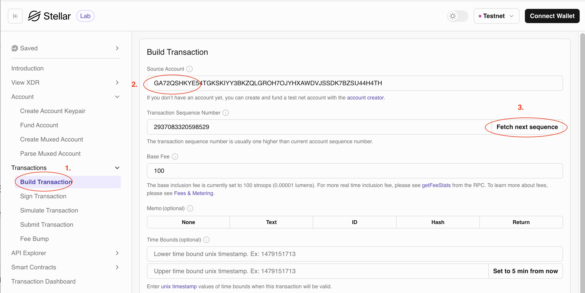
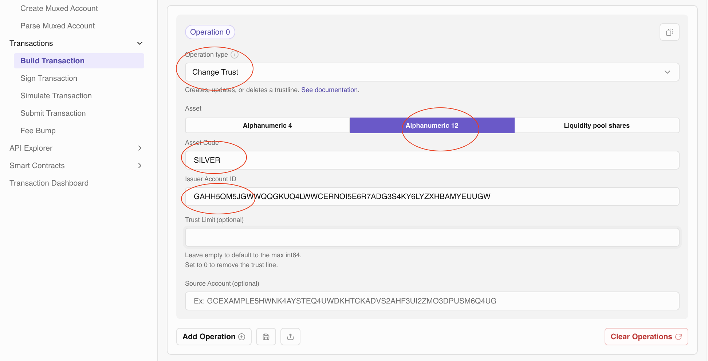
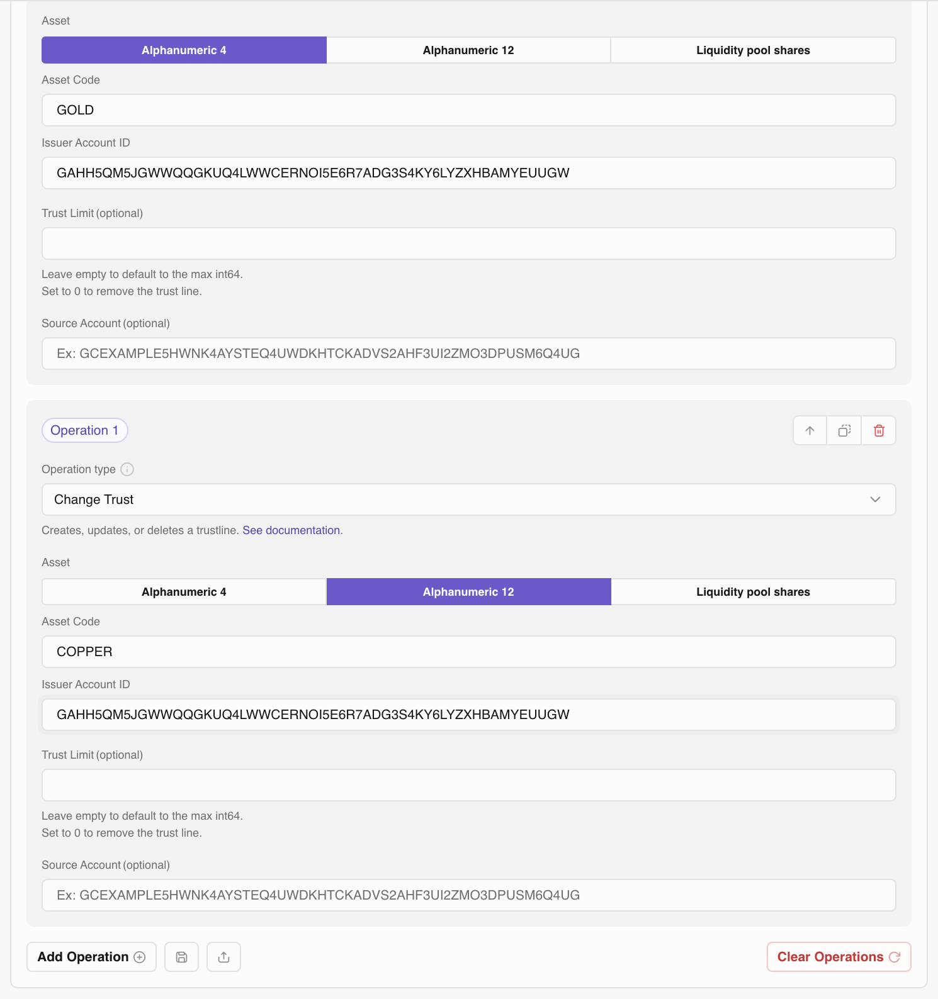
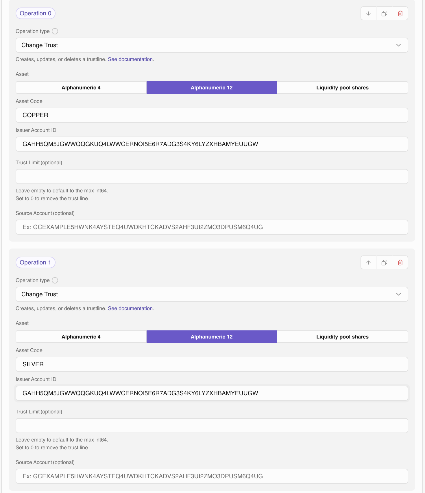

# Preparing data for our test

In order to test the path payment functionality, we will first prepare the test data for it. We will use the [Stellar Lab](https://laboratory.stellar.org/#?network=test) to do so. We have already used it the chapter [`manage tust`](manage_trust.md) to make our user account trust the asset `GOLD` and transfer some `GOLD` to our user. 

## Create recipient account

Next, we will create a new account that will trust the asset `SILVER` of the same issuer as in the [manage tust](manage_trust.md) chapter and transfer some `SILVER` to the new user. We will add his Stellar address to our contacts and use it as the recipient account. We will call the new contact `James`.

First let's create the new account for `James` and fund it on testnet:

Next, let's trust `SILVER` from the issuer `GAHH5QM5JGWWQQGKUQ4LWWCERNOI5E6R7ADG3S4KY6LYZXHBAMYEUUGW`:

Now James can receive `SILVER:GAHH5QM5JGWWQQGKUQ4LWWCERNOI5E6R7ADG3S4KY6LYZXHBAMYEUUGW`

## Add recipient account to contacts

In the contracts view, we can add the new recipient account to our list of contacts by entering his name (`James`) and his Stellar address.

The code can be found in [`ContactsView.swift`](https://github.com/Soneso/SwiftBasicPay/blob/main/SwiftBasicPay/View/ContactsView.swift).

### Create trading accounts

To be able to send path payments we need offers in the order book or in liquidity pools. For our test, we will create two offers in the order book that can be used to trade `GOLD` against `SILVER`. Like in the steps before, we first create and fund two new accounts. Then, we let the first one trust `GOLD` and `COPPER` from our issuer account and the second one trust `COPPER` and `SILVER`.

Change trust for the first trader (`GOLD` and `COPPER`):

Change trust for the second trader (`COPPER` and `SILVER`):

Next, lets fund the trader accounts, so that we can create the offers. Issuer sends 10.000 `COPPER` to the first trader account and 1.000 `SILVER` to the second trader account:

Now, that our first trading account holds `COPPER`, we can create a sell offer by using its address as a source account:

The first trader account sells `COPPER` for `GOLD` at a price of 0.01 units of `GOLD` for 1 unit of `COPPER`.

The second trading account sells `SILVER` for `COPPER`:

They sell `SILVER` for `COPPER` at a price of 10 units of `COPPER` for 1 unit of `SILVER`.

## Summary

Now we have following test data:

1. User account trusts `GOLD` and has a balanace of 300 `GOLD`.
2. Recipient account: `James` created and added to the contacts. `James` trusts and therefore can receive `SILVER`.
3. First trader account trusts `GOLD` and `COPPER` and sells `COPPER` for `GOLD` at a price of 0.01 units of `GOLD` for 1 unit of `COPPER`.
4. Second trader account trusts `COPPER` and `SILVER` and sells `SILVER` for `COPPER` at a price of 10 units of `COPPER` for 1 unit of `SILVER`.

What we want to achieve is that our user account sends `GOLD` and the recipient account receives `SILVER`. This is now possible by using the traders offers in the order book via the following payment path:

`GOLD` -> `COPPER` -> `SILVER` 
