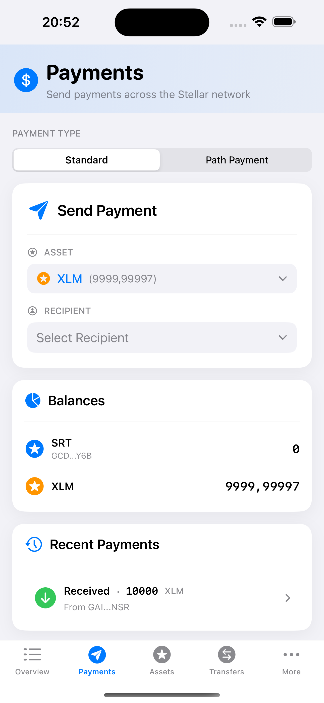
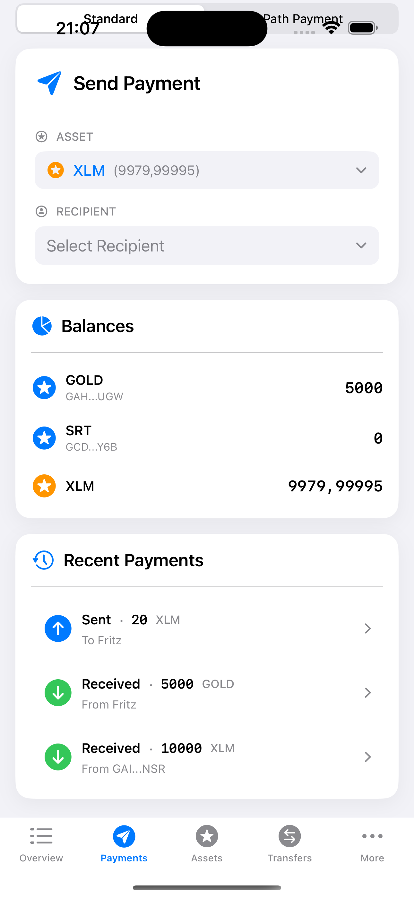

# Payment

A payment operation sends an amount in a specific asset (XLM or non-XLM) to a destination account. With a basic payment operation, the asset sent is the same as the asset received. SwiftBasicPay also allows for path payments (where the asset sent is different than the asset received), which we’ll talk about in the next section.

In our SwiftBasicPay application, the user will navigate to the Payments tab where can either select a user from their contacts or input the public key of a destination address with a specified asset they’d like to send along with the amount of the asset and an optional text memo.



After the user enters the required data, they press the `Submit` button. If the destination account exists and is properly funded with XLM, this will trigger a payment transaction.


## Code implementation

The implementation can be found in [`SendPaymentBox.swift`](https://github.com/Soneso/SwiftBasicPay/blob/main/SwiftBasicPay/View/SendPaymentBox.swift). 

To be able to fill the pickers, it needs to access the available assets that the user holds and their contacts by using our `DashboardData` instance. See also [`dashboard data`](dashboard_data.md).

```swift
var userAssets: [AssetInfo] {
    dashboardData.userAssets
}

var userContacts: [ContactInfo] {
    dashboardData.userContacts
}
```

The `Asset to send` picker is filled with the assets received from our `DashboardData` instance.
The `recipient` picker is filled from the list of contacts, also provided by our `DashboardData` instance. The `recipient` picker also contains an item called `Other`. If selected,
the app let's the user manually insert the Stellar address of the recipient.

As soon as the recipient is selected, the UI displays the form fields to let the user provide the amount, optional memo and pin code. The pin code is needed to obtain the user's signing keypair from the `AuthService` so that the transaction can be signed before submitting it to the Stellar Network.


As soon as the data has been correctly provided by the user and the user pressed the `Submit` button, the payment transaction is prepared, signed, and send to the Stellar Network:

In [`SendPaymentBox.swift`](https://github.com/Soneso/SwiftBasicPay/blob/main/SwiftBasicPay/View/SendPaymentBox.swift):

```swift
let result = try await StellarService.sendPayment(
    destinationAddress: recipientAccountId,
    assetId: stellarAssetId,
    amount: Decimal(Double(amountToSend)!),
    memo: memo,
    userKeyPair: userKeyPair)
```

In [`StellarService.swift`](https://github.com/Soneso/SwiftBasicPay/blob/main/SwiftBasicPay/services/StellarService.swift):


```swift
/// Submits a payment to the Stellar Network by using the wallet sdk. It requires the destinationAddress (account id) of the recipient,
/// the assetId representing the asset to send, amount, optional memo and the user's signing keypair,
/// needed to sign the transaction before submission. Returns true on success.
///
/// - Parameters:
///   - destinationAddress: Account id of the recipeint (G...)
///   - assetId: Asset to send
///   - assetId: Amount to send
///   - memo: Optional memo to attach to the transaction
///   - userKeyPair: The user's signing keypair needed to sign the transaction
///
public static func sendPayment(destinationAddress:String,
                               assetId:StellarAssetId,
                               amount:Decimal,
                               memo:Memo? = nil,
                               userKeyPair:SigningKeyPair) async throws -> Bool {
    let stellar = wallet.stellar
    var txBuilder = try await stellar.transaction(sourceAddress: userKeyPair)
    txBuilder = try txBuilder.transfer(destinationAddress: destinationAddress,
                                    assetId: assetId,
                                    amount: amount)
    if let memo = memo {
        txBuilder = txBuilder.setMemo(memo: memo)
    }
    
    let tx = try txBuilder.build()
    stellar.sign(tx: tx, keyPair: userKeyPair)
    return try await stellar.submitTransaction(signedTransaction: tx)
    
}
```

`StellarService` uses the wallet sdk to build, sign and submit the transaction to the Stellar Network.

All Stellar transactions require a small fee to make it to the ledger. Read more in the Stellar docs [Fees section](https://developers.stellar.org/docs/learn/fundamentals/fees-resource-limits-metering). In SwiftBasicPay, we’re using the default value, so that the user always pays a static fee of 100,000 stroops (one stroop equals 0.0000001 XLM) per operation. Alternatively, you can add a feature to your application that allows the user to set their own fee.

Once the payment has been sent, we ask our `DashboardData` instance refresh it's data':

```swift
await dashboardData.fetchStellarData()
```

The `Recent Payments` box has been updated and we can see it there:



To load the most recent payments we use the wallet_sdk in [`StellarService.swift`](https://github.com/Soneso/SwiftBasicPay/blob/main/SwiftBasicPay/services/StellarService.swift):

```swift
/// Loads the list of the 5 most recent payments for given address (account id).
///
/// - Parameters:
///   - address: Account id to load the most recent payments for
///
public static func loadRecentPayments(address:String) async throws -> [PaymentInfo] {
    let server = wallet.stellar.server
    let paymentsResponseEnum = await server.payments.getPayments(forAccount: address, order: Order.descending, limit: 5)
    switch paymentsResponseEnum {
    case .success(let page):
        let records = page.records
        var result:[PaymentInfo] = []
        for record in records {
            if let payment = record as? PaymentOperationResponse {
                let info = try paymentInfoFromPaymentOperationResponse(payment: payment, address: address)
                result.append(info)
            } else if let payment = record as? AccountCreatedOperationResponse {
                let info = paymentInfoFromAccountCreatedOperationResponse(payment: payment)
                result.append(info)
            } else if let payment = record as? PathPaymentStrictReceiveOperationResponse {
                let info = try paymentInfoFromPathPaymentStrictReceiveOperationResponse(payment: payment, address: address)
                result.append(info)
            } else if let payment = record as? PathPaymentStrictSendOperationResponse {
                let info = try paymentInfoFromPathPaymentStrictSendOperationResponse(payment: payment, address: address)
                result.append(info)
            }
        }
        return result
    case .failure(_):
        throw StellarServiceError.runtimeError("could not load recent payments for \(address)")
    }
}
```

We received the list of recent payments from the wallet sdk. Depending on the type of payment, we extract the data needed and store it in a list of `PaymentInfo` objects, which we then display in the UI.

## Next

Continue with [Path payment](path_payment.md).


