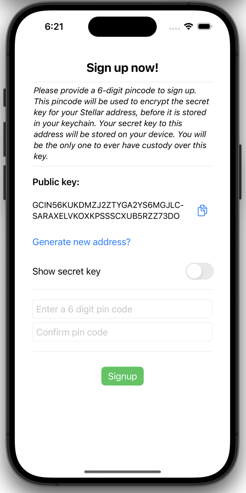

# Sign up and sign in

Depending on whether a user is already registered or not, either the sign up UI or the sign in UI is displayed when the application is started. This is done via the SwiftUI view [`AuthView.swift`](https://github.com/Soneso/SwiftBasicPay/blob/main/SwiftBasicPay/View/AuthView.swift).

## Sign up

To start, we'll have our user create an account. Accounts are the central data structure in Stellar and can only exist with a valid keypair (a public and secret key) and the required minimum balance of XLM. Read more in the [Stellar docs: Accounts section](https://developers.stellar.org/docs/learn/fundamentals/stellar-data-structures/accounts).

In SwiftBasicPay, the [`AuthView`](https://github.com/Soneso/SwiftBasicPay/blob/main/SwiftBasicPay/View/AuthView.swift) will display a randomized public and secret keypair that the user can select with the option to choose a new set if preferred.



To generate a random user keypair, we use the `swift wallet sdk`:

```swift
newUserKeypair = SigningKeyPair.random
```

Next, we'll trigger the user to enter a pincode used to encrypt their secret key before it gets saved to their [`secure local storage`](secure_data_storage.md). The user will need to remember their pincode for future logins and to sign transactions before submitting them to the Stellar Network.

Next we use our `AuthService` (see [`authetication`](authentication.md)) to sign up the user and securely store the users data.

```swift
let address = try authService.signUp(userKeyPair: newUserKeypair, pin: pin)
```

After signup, the user get's redirected to the dashboard home view.


## Sign in


If the user is already registered, the sign in UI is displayed at app start via the SwiftUI view [`AuthView`](https://github.com/Soneso/SwiftBasicPay/blob/main/SwiftBasicPay/View/AuthView.swift).

To sign in, the user must enter his pin code. The pin code is then verified and the user is signed in by using the [`authentication service`](authentication.md).


```swift
let address = try authService.signIn(pin: pin)
```

## Next

Continue with [`Dashboard data`](dashboard_data.md).
