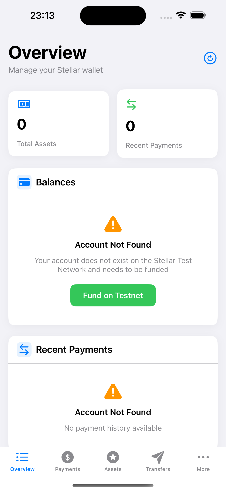

# Account Creation

Stellar accounts require a valid keypair and minimum balance of XLM to exist on the network. After signup, users must fund their account to activate it. Read more in the [Stellar docs: Accounts section](https://developers.stellar.org/docs/learn/fundamentals/stellar-data-structures/accounts).

## Account Funding Flow

### Detecting Unfunded Accounts

The [`Overview`](https://github.com/Soneso/SwiftBasicPay/blob/main/SwiftBasicPay/View/Overview.swift) view detects unfunded accounts through the `BalancesView` component, which checks the `DashboardData` state:



```swift
struct BalancesView: View {
    @Environment(DashboardData.self) var dashboardData
    
    var body: some View {
        DashboardCard(title: "Balances", systemImage: "creditcard.fill") {
            if dashboardData.isLoadingAssets {
                // Loading state
                HStack {
                    ProgressView()
                        .scaleEffect(0.8)
                    Text("Loading balances...")
                        .font(.system(size: 14))
                        .foregroundColor(.secondary)
                }
                .frame(maxWidth: .infinity)
                .padding(.vertical, 20)
            } else if let error = dashboardData.userAssetsLoadingError {
                // Error state - includes account not found
                ErrorStateView(error: error)
                    .environment(dashboardData)
            } else if dashboardData.userAssets.isEmpty {
                // Empty state
                EmptyStateView(
                    icon: "creditcard.trianglebadge.exclamationmark",
                    title: "No Assets",
                    message: "Your account doesn't hold any assets yet"
                )
            } else {
                // Display assets
                VStack(spacing: 12) {
                    ForEach(dashboardData.userAssets, id: \.id) { asset in
                        AssetRow(asset: asset, isSelected: selectedAsset?.id == asset.id)
                    }
                }
            }
        }
    }
}
```

### Error State View Component

The `ErrorStateView` component handles account not found errors with funding capability:

```swift
struct ErrorStateView: View {
    let error: DashboardDataError
    @State private var isFundingAccount = false
    @State private var fundingError: String?
    @Environment(DashboardData.self) var dashboardData
    
    var body: some View {
        VStack(spacing: 12) {
            Image(systemName: "exclamationmark.triangle.fill")
                .font(.system(size: 32))
                .foregroundColor(.orange)
            
            switch error {
            case .accountNotFound(_):
                Text("Account Not Found")
                    .font(.system(size: 16, weight: .semibold))
                Text("Your account does not exist on the Stellar Test Network and needs to be funded")
                    .font(.system(size: 14))
                    .foregroundColor(.secondary)
                    .multilineTextAlignment(.center)
                    .padding(.horizontal)
                
                if let fundingError = fundingError {
                    Text(fundingError)
                        .font(.system(size: 12))
                        .foregroundColor(.red)
                        .multilineTextAlignment(.center)
                        .padding(.horizontal)
                }
                
                if isFundingAccount {
                    ProgressView()
                        .scaleEffect(0.8)
                        .padding(.top, 8)
                } else {
                    Button(action: {
                        Task {
                            await fundAccount()
                        }
                    }) {
                        Text("Fund on Testnet")
                            .font(.system(size: 15, weight: .semibold))
                            .foregroundColor(.white)
                            .padding(.horizontal, 24)
                            .padding(.vertical, 12)
                            .background(Color.green)
                            .cornerRadius(10)
                    }
                    .padding(.top, 8)
                }
                
            case .fetchingError(let message):
                Text("Error Loading Data")
                    .font(.system(size: 16, weight: .semibold))
                Text(message)
                    .font(.system(size: 14))
                    .foregroundColor(.secondary)
                    .multilineTextAlignment(.center)
            }
        }
        .padding(.vertical, 20)
        .frame(maxWidth: .infinity)
    }
}
```

## Funding Implementation

### Using Friendbot on Testnet

The funding process is implemented in `ErrorStateView` and uses [`StellarService`](https://github.com/Soneso/SwiftBasicPay/blob/main/SwiftBasicPay/services/StellarService.swift) to request XLM from Friendbot:

```swift
@MainActor
private func fundAccount() async {
    isFundingAccount = true
    fundingError = nil
    
    do {
        // Request funding from Friendbot
        try await StellarService.fundTestnetAccount(address: dashboardData.userAddress)
        
        // Clear the account cache to force a fresh check
        dashboardData.clearAccountCache()
        
        // Force refresh all data (bypasses the 2-second minimum refresh interval)
        await dashboardData.forceRefreshAll()
        
        // Haptic feedback for success
        let successFeedback = UINotificationFeedbackGenerator()
        successFeedback.notificationOccurred(.success)
    } catch {
        fundingError = "Error funding account: \(error.localizedDescription)"
        
        // Haptic feedback for error
        let errorFeedback = UINotificationFeedbackGenerator()
        errorFeedback.notificationOccurred(.error)
    }
    
    isFundingAccount = false
}
```

### StellarService Integration

The wallet SDK provides Friendbot integration:

```swift
/// Funds the user account on the Stellar Test Network using Friendbot
public static func fundTestnetAccount(address:String) async throws {
    return try await wallet.stellar.fundTestNetAccount(address: address)
}
```

The wallet SDK handles:
- Friendbot API request
- Error handling
- Response validation

## Data Refresh After Funding

### Automatic State Update

After successful funding, the app performs a force refresh:

```swift
// Clear the account cache to force a fresh check
dashboardData.clearAccountCache()

// Force refresh all data (bypasses cache and minimum refresh interval)
await dashboardData.forceRefreshAll()
```

This force refresh operation:
1. Clears all cached data (account existence, assets, payments)
2. Bypasses the 2-second minimum refresh interval
3. Fetches fresh user assets (confirms account exists)
4. Loads initial payment history
5. Updates all dependent views immediately

### AssetManager Cache Clearing

The `AssetManager` properly handles the transition:

```swift
/// Clear cached account existence (useful when account might have been funded)
func clearAccountCache() {
    cachedAccountExists = nil
}
```

## Funded Account Display

After funding, the UI automatically updates:


The assets are displayed using the `AssetRow` component within `BalancesView`:

```swift
struct AssetRow: View {
    let asset: AssetInfo
    let isSelected: Bool
    
    var body: some View {
        VStack(spacing: 8) {
            HStack {
                // Asset icon
                Image(systemName: "star.circle.fill")
                    .font(.system(size: 28))
                    .foregroundColor(asset.id == "native" ? .orange : .blue)
                
                VStack(alignment: .leading, spacing: 4) {
                    Text(asset.code)
                        .font(.system(size: 16, weight: .semibold))
                        .foregroundColor(.primary)
                    
                    if let issuer = asset.issuer, !issuer.isEmpty {
                        Text(issuer.shortAddress)
                            .font(.system(size: 11, design: .monospaced))
                            .foregroundColor(.secondary)
                    }
                }
                
                Spacer()
                
                VStack(alignment: .trailing, spacing: 4) {
                    Text(asset.formattedBalance)
                        .font(.system(size: 18, weight: .bold, design: .rounded))
                        .foregroundColor(.primary)
                    
                    Text(asset.code)
                        .font(.system(size: 12, weight: .medium))
                        .foregroundColor(.secondary)
                }
            }
            .padding(12)
            .background(isSelected ? Color.blue.opacity(0.05) : Color(.systemGray6))
            .cornerRadius(10)
        }
    }
}
```

## Production Considerations

When moving to Mainnet, consider these funding options:

### 1. User-Funded Accounts
Users provide their own XLM:
```swift
// Display minimum balance requirement
Text("Minimum balance: 1 XLM")
Text("Send XLM to: \(userAddress)")
```

### 2. Service-Funded Accounts
The app sponsors account creation using the wallet sdk. See [doc](https://github.com/Soneso/stellar-swift-wallet-sdk/blob/main/docs/stellar.md#building-advanced-transactions)


## Account State Management

This architecture tracks account state through:

1. **DataState Enum**: Unified loading/error states
2. **Caching**: 60-second TTL for account existence
3. **Automatic Retry**: Smart refresh on error
4. **User Feedback**: Clear error messages and actions


## Next

Continue with [`Manage trust`](manage_trust.md).