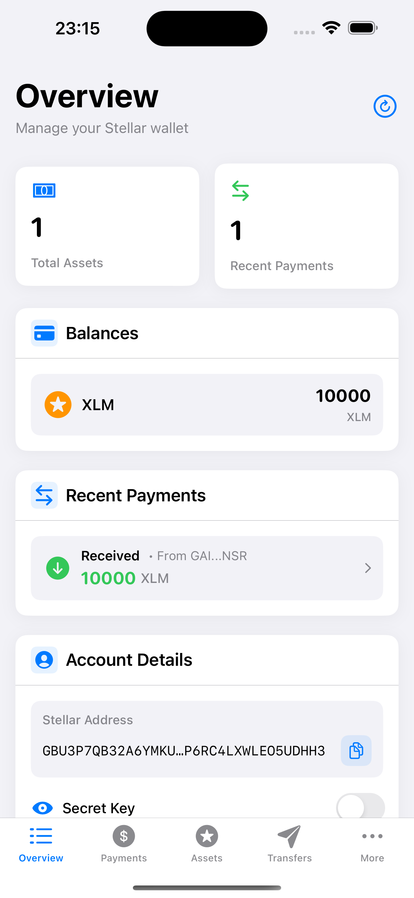

# Account Creation

Stellar accounts require a valid keypair and minimum balance of XLM to exist on the network. After signup, users must fund their account to activate it. Read more in the [Stellar docs: Accounts section](https://developers.stellar.org/docs/learn/fundamentals/stellar-data-structures/accounts).

## Account Funding Flow

### Detecting Unfunded Accounts

The modern [`Overview`](https://github.com/Soneso/SwiftBasicPay/blob/main/SwiftBasicPay/View/Overview.swift) view detects unfunded accounts through the `DashboardData` state:


```swift
struct Overview: View {
    @Environment(DashboardData.self) var dashboardData
    
    var body: some View {
        ScrollView {
            VStack(spacing: 20) {
                // Check account status through asset state
                switch dashboardData.userAssetsState {
                case .error(let error):
                    if case DashboardDataError.accountNotFound = error {
                        AccountNotFoundView()
                    }
                default:
                    // Regular content
                }
            }
        }
    }
}
```

### Account Not Found View Component

The error state UI with funding capability:

```swift
struct AccountNotFoundView: View {
    @State private var isFundingAccount = false
    @State private var fundingError: String?
    
    var body: some View {
        VStack(spacing: 12) {
            Image(systemName: "exclamationmark.triangle.fill")
                .font(.system(size: 32))
                .foregroundColor(.orange)
            
            Text("Account Not Found")
                .font(.system(size: 16, weight: .semibold))
            
            Text("Your account does not exist on the Stellar Test Network and needs to be funded")
                .font(.system(size: 14))
                .foregroundColor(.secondary)
                .multilineTextAlignment(.center)
            
            if let fundingError = fundingError {
                Text(fundingError)
                    .font(.system(size: 12))
                    .foregroundColor(.red)
            }
            
            if isFundingAccount {
                ProgressView()
                    .scaleEffect(0.8)
            } else {
                Button(action: {
                    Task {
                        await fundAccount()
                    }
                }) {
                    Text("Fund on Testnet")
                        .font(.system(size: 15, weight: .semibold))
                        .foregroundColor(.white)
                        .padding(.horizontal, 24)
                        .padding(.vertical, 12)
                        .background(Color.green)
                        .cornerRadius(10)
                }
            }
        }
        .padding(.vertical, 20)
    }
}
```

## Funding Implementation

### Using Friendbot on Testnet

The funding process uses [`StellarService`](https://github.com/Soneso/SwiftBasicPay/blob/main/SwiftBasicPay/services/StellarService.swift) to request XLM from Friendbot:

```swift
@MainActor
private func fundAccount() async {
    isFundingAccount = true
    fundingError = nil
    
    do {
        // Request funding from Friendbot
        try await StellarService.fundTestnetAccount(
            address: dashboardData.userAddress
        )
        
        // Refresh data to show funded state
        await dashboardData.fetchStellarData()
        
        // Haptic feedback for success
        let successFeedback = UINotificationFeedbackGenerator()
        successFeedback.notificationOccurred(.success)
    } catch {
        fundingError = "Error funding account: \(error.localizedDescription)"
        
        // Haptic feedback for error
        let errorFeedback = UINotificationFeedbackGenerator()
        errorFeedback.notificationOccurred(.error)
    }
    
    isFundingAccount = false
}
```

### StellarService Integration

The wallet SDK provides Friendbot integration:

```swift
/// Funds the user account on the Stellar Test Network using Friendbot
public static func fundTestnetAccount(address:String) async throws {
    return try await wallet.stellar.fundTestNetAccount(address: address)
}
```

The wallet SDK handles:
- Friendbot API request
- Error handling
- Response validation

## Data Refresh After Funding

### Automatic State Update

After successful funding, `DashboardData` refreshes all data:

```swift
await dashboardData.fetchStellarData()
```

This parallel fetch operation:
1. Clears the account existence cache
2. Fetches user assets (confirms account exists)
3. Loads initial payment history
4. Updates all dependent views

### AssetManager Cache Clearing

The `AssetManager` properly handles the transition:

```swift
/// Clear cached account existence (useful when account might have been funded)
func clearAccountCache() {
    cachedAccountExists = nil
}
```

## Funded Account Display

After funding, the UI automatically updates:



The assets are displayed with balances:

```swift
struct BalancesSection: View {
    let assets: [AssetInfo]
    
    var body: some View {
        VStack(spacing: 12) {
            ForEach(assets) { asset in
                HStack {
                    AssetIcon(asset: asset)
                    
                    VStack(alignment: .leading) {
                        Text(asset.displayName)
                            .font(.system(size: 14, weight: .medium))
                        Text(asset.assetCode)
                            .font(.system(size: 12))
                            .foregroundColor(.secondary)
                    }
                    
                    Spacer()
                    
                    Text(asset.formattedBalance)
                        .font(.system(size: 16, weight: .semibold, design: .rounded))
                }
                .padding(12)
                .background(Color(.systemGray6))
                .cornerRadius(10)
            }
        }
    }
}
```

## Production Considerations

When moving to Mainnet, consider these funding options:

### 1. User-Funded Accounts
Users provide their own XLM:
```swift
// Display minimum balance requirement
Text("Minimum balance: 1 XLM")
Text("Send XLM to: \(userAddress)")
```

### 2. Service-Funded Accounts
The app sponsors account creation using the wallet sdk. See [doc](https://github.com/Soneso/stellar-swift-wallet-sdk/blob/main/docs/stellar.md#building-advanced-transactions)


## Account State Management

This architecture tracks account state through:

1. **DataState Enum**: Unified loading/error states
2. **Caching**: 60-second TTL for account existence
3. **Automatic Retry**: Smart refresh on error
4. **User Feedback**: Clear error messages and actions

## Error Handling

Common funding errors and handling:

```swift
enum FundingError: LocalizedError {
    case networkError
    case friendbotUnavailable
    case accountAlreadyExists
    
    var errorDescription: String? {
        switch self {
        case .networkError:
            return "Network connection failed. Please check your connection."
        case .friendbotUnavailable:
            return "Testnet funding service is temporarily unavailable."
        case .accountAlreadyExists:
            return "Account is already funded."
        }
    }
}
```

## Next

Continue with [`Manage trust`](manage_trust.md).