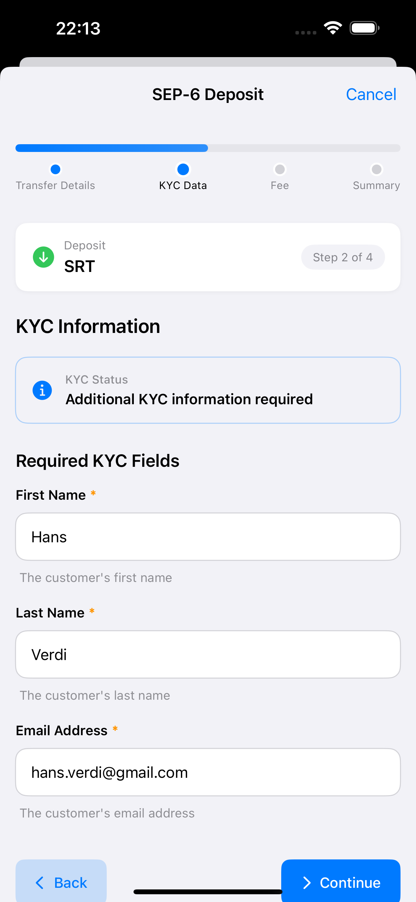
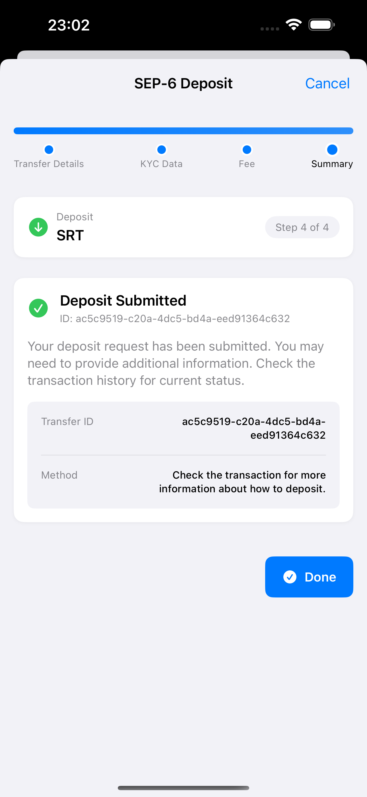

# Anchor Integration

## Overview

Anchors are bridge services that connect the Stellar network to traditional banking systems, enabling users to move value between fiat currencies and digital assets. They act as trusted entities that hold deposits in traditional banking systems and issue corresponding tokens on the Stellar network, or vice versa for withdrawals.

SwiftBasicPay implements a comprehensive anchor integration using the [Stellar Wallet SDK](https://github.com/Soneso/stellar-wallet-sdk-ios), which provides high-level abstractions for complex anchor operations. This tutorial will guide you through the complete implementation, explaining how the wallet SDK simplifies anchor interactions.

### Key Concepts

- **Deposits**: Converting fiat currency to Stellar assets (on-ramp)
- **Withdrawals**: Converting Stellar assets back to fiat currency (off-ramp)
- **Anchored Assets**: Stellar assets that represent real-world value held by an anchor
- **KYC/AML**: Know Your Customer and Anti-Money Laundering compliance requirements

## Supported Protocols

SwiftBasicPay integrates multiple Stellar Ecosystem Proposals (SEPs) through the wallet SDK:

- **[SEP-1](https://github.com/stellar/stellar-protocol/blob/master/ecosystem/sep-0001.md)**: Stellar TOML - Provides anchor metadata and service endpoints
- **[SEP-10](https://github.com/stellar/stellar-protocol/blob/master/ecosystem/sep-0010.md)**: Web Authentication - Proves account ownership to anchors
- **[SEP-6](https://github.com/stellar/stellar-protocol/blob/master/ecosystem/sep-0006.md)**: Deposit/Withdrawal API - Traditional REST-based transfer protocol
- **[SEP-9](https://github.com/stellar/stellar-protocol/blob/master/ecosystem/sep-0009.md)**: Standard KYC Fields - Defines standard customer information fields
- **[SEP-12](https://github.com/stellar/stellar-protocol/blob/master/ecosystem/sep-0012.md)**: KYC API - Customer information collection and verification
- **[SEP-24](https://github.com/stellar/stellar-protocol/blob/master/ecosystem/sep-0024.md)**: Hosted Deposit/Withdrawal - Interactive web-based transfers

## Architecture Overview

The anchor integration follows a layered architecture:

```
┌─────────────────────────────────────────┐
│           SwiftUI Views                 │
│  (TransfersView, NewTransferView, etc.) │
└────────────────┬────────────────────────┘
                 │
┌────────────────▼────────────────────────┐
│         View Models                     │
│  (TransfersViewModel, etc.)             │
└────────────────┬────────────────────────┘
                 │
┌────────────────▼────────────────────────┐
│      Stellar Wallet SDK                 │
│  (Anchor, Sep1, Sep6, Sep10, etc.)      │
└────────────────┬────────────────────────┘
                 │
┌────────────────▼────────────────────────┐
│      Stellar Horizon API                │
│      Anchor Services                    │
└─────────────────────────────────────────┘
```

## Wallet SDK Integration

The Stellar Wallet SDK provides several key benefits:

1. **Simplified API**: High-level abstractions for complex protocols
2. **Protocol Compliance**: Automatic handling of SEP specifications
3. **Error Handling**: Consistent error types and recovery strategies
4. **Type Safety**: Strongly-typed Swift interfaces

### Initializing the Wallet SDK

The wallet SDK is initialized in `StellarService.swift`:

```swift
import stellar_wallet_sdk

public class StellarService {
    // The wallet instance manages all SDK operations
    public static var wallet: Wallet = {
        let stellar = StellarConfiguration(
            network: .testnet,
            baseFee: 100_000,
            horizonUrl: "https://horizon-testnet.stellar.org"
        )
        
        let config = WalletConfiguration(
            stellar: stellar,
            // Additional configuration for anchors, etc.
        )
        
        return Wallet(config: config)
    }()
    
    // Create anchor instances for specific home domains
    public static func anchor(homeDomain: String) -> stellar_wallet_sdk.Anchor {
        return wallet.anchor(homeDomain: homeDomain)
    }
}
```

## Transfers View Architecture

The [`TransfersView`](https://github.com/Soneso/SwiftBasicPay/blob/main/SwiftBasicPay/View/TransfersView.swift) serves as the main entry point for anchor operations:


```swift
@Observable
class TransfersViewModel {
    // MARK: - State Management
    enum ViewState: Equatable {
        case initial                        // Initial state, no asset selected
        case loading(message: String)        // Loading with progress message
        case pinRequired                     // Awaiting PIN for authentication
        case transferReady                   // Ready to initiate transfers
        case error(String)                   // Error state with message
    }
    
    // Transfer modes: New transfer creation or history viewing
    enum TransferMode: Int, CaseIterable {
        case newTransfer = 1
        case history = 2
        
        var title: String {
            switch self {
            case .newTransfer: return "New"
            case .history: return "History"
            }
        }
    }
    
    // MARK: - Observable Properties
    var mode: TransferMode = .newTransfer
    var state: ViewState = .initial
    var selectedAssetInfo: AnchoredAssetInfo?
    var pin = ""
    var pinError: String?
    
    // MARK: - Anchor Data
    var sep10AuthToken: AuthToken?      // SEP-10 authentication token
    var tomlInfo: TomlInfo?             // SEP-1 TOML information
    var sep6Info: Sep6Info?             // SEP-6 transfer capabilities
    var sep24Info: Sep24Info?           // SEP-24 interactive transfer info
    
    // Anchored assets available for transfer
    var anchoredAssets: [AnchoredAssetInfo] = []
}
```

### State Flow

1. **Initial State**: User selects an anchored asset
2. **Loading TOML**: Fetches anchor configuration via SEP-1
3. **PIN Required**: Prompts for PIN to authenticate
4. **Authentication**: Performs SEP-10 authentication
5. **Transfer Ready**: Displays available transfer options

## Finding Anchored Assets

The first step is identifying which assets in the user's wallet are anchored. The wallet SDK helps by providing access to asset information and anchor connections:


```swift
public static func getAnchoredAssets(
    fromAssets: [AssetInfo]
) async throws -> [AnchoredAssetInfo] {
    var anchoredAssets: [AnchoredAssetInfo] = []
    
    // Access the Stellar service through wallet SDK
    let stellar = wallet.stellar
    
    for assetInfo in fromAssets {
        let asset = assetInfo.asset
        var anchorDomain: String?
        
        // We are only interested in issued assets (not native XLM)
        if let issuedAsset = asset as? IssuedAssetId {
            // Verify the issuer account exists on the network
            let issuerExists = try await stellar.account.accountExists(
                accountAddress: issuedAsset.issuer
            )
            if !issuerExists {
                continue
            }
            
            // Check if it's a known test anchor asset
            // The test anchor (anchor-sep-server-dev.stellar.org) provides
            // SRT and USDC test assets for development
            if testAnchorAssets.contains(where: {
                $0.code == issuedAsset.code && 
                $0.issuer == issuedAsset.issuer
            }) {
                anchorDomain = testAnchorDomain
            } else {
                // For production assets, load the home_domain from the issuer's account
                // The home_domain field links the asset to its anchor service
                let issuerAccountInfo = try await stellar.account.getInfo(
                    accountAddress: issuedAsset.issuer
                )
                if let homeDomain = issuerAccountInfo.homeDomain {
                    anchorDomain = homeDomain
                }
            }
            
            if let domain = anchorDomain {
                // Create an AnchoredAssetInfo with the wallet SDK's anchor instance
                let info = AnchoredAssetInfo(
                    asset: issuedAsset,
                    balance: assetInfo.balance,
                    anchor: wallet.anchor(homeDomain: domain)  // SDK creates anchor
                )
                anchoredAssets.append(info)
            }
        }
    }
    
    return anchoredAssets
}
```

### Key Points:
- The wallet SDK's `stellar.account` service provides account information
- The `home_domain` field connects assets to their anchor services
- The SDK's `wallet.anchor()` factory creates properly configured anchor instances

## SEP-1: Loading Anchor Information

SEP-1 defines the `stellar.toml` file that provides anchor metadata and service endpoints. The wallet SDK handles the complexities of fetching and parsing this file:

```swift
@MainActor
private func checkWebAuth(anchor: stellar_wallet_sdk.Anchor) async {
    state = .loading(message: "Loading anchor configuration")
    tomlInfo = nil
    
    do {
        // The wallet SDK's anchor.sep1 property automatically:
        // 1. Constructs the TOML URL: https://[domain]/.well-known/stellar.toml
        // 2. Fetches the TOML file
        // 3. Parses and validates the content
        // 4. Returns strongly-typed TomlInfo
        tomlInfo = try await anchor.sep1
    } catch {
        state = .error("Could not load anchor data: \(error.localizedDescription)")
        return
    }
    
    // Verify the anchor supports SEP-10 authentication
    // The webAuthEndpoint is required for secure authentication
    guard tomlInfo?.webAuthEndpoint != nil else {
        state = .error("The anchor does not provide authentication service (SEP-10)")
        return
    }
    
    state = .pinRequired
}
```

### TOML Information Structure

The `TomlInfo` object from the wallet SDK contains:
- `webAuthEndpoint`: SEP-10 authentication endpoint
- `transferServer`: SEP-6 transfer service URL
- `transferServerSep24`: SEP-24 interactive transfer URL
- `kycServer`: SEP-12 KYC service endpoint
- `accounts`: Anchor's Stellar accounts
- `signingKey`: Anchor's signing key for verification

## SEP-10: Web Authentication

SEP-10 provides a secure way to prove account ownership to an anchor. The wallet SDK handles the complex challenge-response flow:


```swift
@MainActor
func authenticateWithPin() async {
    // Haptic feedback for better UX
    let feedback = UINotificationFeedbackGenerator()
    
    guard !pin.isEmpty else {
        pinError = "Please enter your PIN"
        feedback.notificationOccurred(.error)
        return
    }
    
    state = .loading(message: "Authenticating with anchor")
    pinError = nil
    
    // Step 1: Retrieve the user's signing keypair from secure storage
    var userKeyPair: SigningKeyPair?
    do {
        let authService = AuthService()
        userKeyPair = try authService.userKeyPair(pin: pin)
    } catch {
        pinError = error.localizedDescription
        state = .pinRequired
        feedback.notificationOccurred(.error)
        return
    }
    
    // Clear PIN from memory for security
    pin = ""
    
    guard let selectedAsset = selectedAssetInfo else {
        resetState()
        state = .error("Please select an asset")
        return
    }
    
    // Step 2: Perform SEP-10 authentication using wallet SDK
    let anchor = selectedAsset.anchor
    do {
        // The wallet SDK's sep10 service handles:
        // 1. Requesting a challenge transaction from the anchor
        // 2. Verifying the anchor's signature
        // 3. Signing the challenge with the user's key
        // 4. Submitting the signed challenge
        // 5. Receiving and storing the JWT auth token
        let sep10 = try await anchor.sep10
        sep10AuthToken = try await sep10.authenticate(userKeyPair: userKeyPair!)
    } catch {
        pinError = error.localizedDescription
        state = .pinRequired
        feedback.notificationOccurred(.error)
        return
    }
    
    // Step 3: Load available transfer services
    await loadTransferInfo()
}
```

### SEP-10 Authentication Flow (handled by SDK):

1. **Challenge Request**: SDK requests a challenge from the anchor
2. **Challenge Verification**: SDK verifies the challenge transaction is properly formed and signed by the anchor
3. **Challenge Signing**: SDK signs the challenge with the user's private key
4. **Challenge Submission**: SDK submits the signed challenge back to the anchor
5. **Token Receipt**: SDK receives and stores the JWT authentication token

## Loading Transfer Services

After authentication, the app queries which transfer services the anchor supports:

```swift
@MainActor
private func loadTransferInfo() async {
    sep6Info = nil
    sep24Info = nil
    
    state = .loading(message: "Loading transfer services")
    
    // Check TOML for available services
    let sep6Supported = tomlInfo?.transferServer != nil
    let sep24Supported = tomlInfo?.transferServerSep24 != nil
    
    guard sep6Supported || sep24Supported else {
        state = .error("The anchor does not support SEP-6 or SEP-24 transfers")
        return
    }
    
    var errorMessages: [String] = []
    
    // Load SEP-6 capabilities if available
    if sep6Supported {
        do {
            // The wallet SDK's sep6.info call:
            // 1. Makes authenticated request to /info endpoint
            // 2. Parses deposit/withdrawal options for each asset
            // 3. Returns structured Sep6Info with capabilities
            sep6Info = try await selectedAssetInfo?.anchor.sep6.info(authToken: sep10AuthToken)
        } catch {
            errorMessages.append("SEP-6: \(error.localizedDescription)")
        }
    }
    
    // Load SEP-24 capabilities if available
    if sep24Supported {
        do {
            // SEP-24 info doesn't require authentication
            sep24Info = try await selectedAssetInfo?.anchor.sep24.info
        } catch {
            errorMessages.append("SEP-24: \(error.localizedDescription)")
        }
    }
    
    // Handle partial failures gracefully
    if !errorMessages.isEmpty && sep6Info == nil && sep24Info == nil {
        state = .error(errorMessages.joined(separator: "\n"))
    } else {
        state = .transferReady
        let feedback = UINotificationFeedbackGenerator()
        feedback.notificationOccurred(.success)
    }
}
```

## New Transfer View

The [`NewTransferView`](https://github.com/Soneso/SwiftBasicPay/blob/main/SwiftBasicPay/View/NewTransferView.swift) presents available transfer options based on the anchor's capabilities:


```swift
struct NewTransferView: View {
    // MARK: - Properties
    private var assetInfo: AnchoredAssetInfo
    private var authToken: AuthToken
    private var sep6Info: Sep6Info?
    private var sep24Info: Sep24Info?
    private var savedKycData: [KycEntry]  // Pre-filled KYC data from secure storage
    
    // MARK: - State
    @State private var showSep6DepositSheet = false
    @State private var showSep6WithdrawalSheet = false
    @State private var showSep24InteractiveUrlSheet = false
    @State private var isLoadingSep24InteractiveUrl = false
    @State private var loadingSep24InteractiveUrlErrorMessage: String?
    @State private var sep24InteractiveUrl: String?
    @State private var sep24OperationMode: String?
    @State private var hoveredButton: String? = nil
    
    internal init(assetInfo: AnchoredAssetInfo,
                  authToken: AuthToken,
                  sep6Info: Sep6Info? = nil,
                  sep24Info: Sep24Info? = nil,
                  savedKycData: [KycEntry] = []) {
        self.assetInfo = assetInfo
        self.authToken = authToken
        self.sep6Info = sep6Info
        self.sep24Info = sep24Info
        self.savedKycData = savedKycData
    }
    
    var body: some View {
        ScrollView {
            VStack(spacing: 24) {
                // Show SEP-6 options if available
                if sep6Info != nil {
                    sep6TransferCard
                }
                
                // Show SEP-24 options if available
                if sep24Info != nil {
                    sep24TransferCard
                }
                
                // Show empty state if no services available
                if sep6Info == nil && sep24Info == nil {
                    EmptyStateView(
                        icon: "exclamationmark.triangle",
                        title: "No Transfer Options",
                        message: "This anchor doesn't support transfers for this asset"
                    )
                }
            }
        }
    }
}
```

## SEP-6: Traditional Deposit/Withdrawal

SEP-6 provides a REST API-based approach for deposits and withdrawals. It's "traditional" because it relies on the wallet handling most of the flow.

### SEP-6 Deposit Flow


The deposit process is managed by a multi-step form:

```swift
private var sep6TransferCard: some View {
    VStack(alignment: .leading, spacing: 16) {
        // Section header with visual hierarchy
        HStack {
            Image(systemName: "6.circle.fill")
                .font(.title2)
                .foregroundStyle(.blue)
            
            VStack(alignment: .leading, spacing: 2) {
                Text("SEP-6 Transfers")
                    .font(.headline)
                Text("Traditional transfer protocol")
                    .font(.caption)
                    .foregroundStyle(.secondary)
            }
            
            Spacer()
            
            Image(systemName: "info.circle")
                .font(.caption)
                .foregroundStyle(.secondary)
        }
        
        // Transfer buttons
        VStack(spacing: 12) {
            // Deposit button - only shown if anchor supports deposits for this asset
            if let depositInfo = sep6Info?.deposit,
               let assetDepositInfo = depositInfo[assetInfo.code],
               assetDepositInfo.enabled {
                
                Button(action: {
                    showSep6DepositSheet = true
                }) {
                    transferButton(
                        title: "Deposit",
                        icon: "arrow.down.circle.fill",
                        color: .green,
                        isHovered: hoveredButton == "sep6-deposit"
                    )
                }
                .buttonStyle(PlainButtonStyle())
                .onHover { hovering in
                    hoveredButton = hovering ? "sep6-deposit" : nil
                }
                .sheet(isPresented: $showSep6DepositSheet) {
                    // Present the deposit stepper with all required data
                    Sep6DepositStepper(
                        anchoredAsset: assetInfo,
                        depositInfo: assetDepositInfo,
                        authToken: authToken,
                        anchorHasEnabledFeeEndpoint: sep6Info?.fee?.enabled ?? false,
                        savedKycData: savedKycData
                    )
                }
            }
            
            // Similar structure for withdrawal button...
        }
    }
}
```

### SEP-6 Deposit Stepper Implementation

The `Sep6DepositStepper` manages a four-step deposit process:

1. **Transfer Details**: Amount and deposit type selection
2. **KYC Data**: Customer information collection
3. **Fee Review**: Display transfer fees
4. **Summary & Submission**: Review and confirm

```swift
// Sep6DepositStepper.swift
struct Sep6DepositStepper: View {
    @StateObject private var viewModel: Sep6DepositViewModel
    
    var body: some View {
        VStack {
            // Progress indicator
            ProgressView(value: Double(viewModel.currentStep), total: 4)
            
            // Step content
            switch viewModel.currentStep {
            case 1:
                TransferDetailsStep(viewModel: viewModel)
            case 2:
                KYCDataStep(viewModel: viewModel)
            case 3:
                FeeStep(viewModel: viewModel)
            case 4:
                SummaryStep(viewModel: viewModel)
            default:
                EmptyView()
            }
        }
    }
}
```

## SEP-12: KYC Integration

SEP-12 handles Know Your Customer (KYC) data collection. The wallet SDK provides structured interfaces for KYC operations:



### KYC Data Collection

```swift
// In Sep6DepositViewModel
@MainActor
func loadRequiredKycFields() async {
    isLoadingKycFields = true
    requiredKycFields = []
    
    do {
        // The wallet SDK's sep12 service handles KYC operations
        let sep12 = try await anchoredAsset.anchor.sep12(authToken: authToken)
        
        // Get required fields for the deposit operation
        // The SDK automatically:
        // 1. Makes request to GET /customer endpoint
        // 2. Parses the required fields based on SEP-9 standards
        // 3. Returns structured field requirements
        let customerInfo = try await sep12.getCustomer(
            type: "sep6-deposit",
            memo: nil
        )
        
        // Check if KYC is already approved
        if customerInfo.status == .accepted {
            kycStatus = .accepted
            // Skip KYC step if already approved
            await nextStep()
        } else {
            // Parse required fields from the response
            requiredKycFields = customerInfo.fields ?? []
            kycStatus = customerInfo.status
        }
    } catch {
        kycErrorMessage = "Failed to load KYC requirements: \(error.localizedDescription)"
    }
    
    isLoadingKycFields = false
}
```

### KYC Form Submission


```swift
@MainActor
func submitKycData() async {
    isSubmittingKyc = true
    
    do {
        let sep12 = try await anchoredAsset.anchor.sep12(authToken: authToken)
        
        // Prepare KYC data according to SEP-9 standards
        var kycData: [String: String] = [:]
        for field in kycFormData {
            kycData[field.key] = field.value
        }
        
        // Submit KYC data through wallet SDK
        // The SDK:
        // 1. Validates field formats
        // 2. Makes PUT request to /customer endpoint
        // 3. Handles multipart form data if needed
        // 4. Returns updated customer status
        let response = try await sep12.putCustomer(
            fields: kycData,
            type: "sep6-deposit"
        )
        
        // Save KYC data locally for future use
        saveKycDataToSecureStorage(kycData)
        
        // Check new status
        if response.status == .accepted {
            kycStatus = .accepted
            await nextStep()
        } else if response.status == .pending {
            kycStatus = .pending
            kycPendingMessage = "Your KYC is under review"
        }
    } catch {
        kycSubmissionError = error.localizedDescription
    }
    
    isSubmittingKyc = false
}
```

### Secure KYC Storage

KYC data is stored securely using the Keychain:

```swift
class KycManager {
    private let secureStorage = SecureStorage()
    
    func saveKycData(_ data: [String: String]) {
        // Encrypt and store in Keychain
        do {
            let jsonData = try JSONSerialization.data(withJSONObject: data)
            try secureStorage.save(key: "kyc_data", data: jsonData)
        } catch {
            print("Failed to save KYC data: \(error)")
        }
    }
    
    func loadKycData() -> [String: String]? {
        // Retrieve and decrypt from Keychain
        do {
            guard let data = try secureStorage.load(key: "kyc_data") else { return nil }
            return try JSONSerialization.jsonObject(with: data) as? [String: String]
        } catch {
            print("Failed to load KYC data: \(error)")
            return nil
        }
    }
}
```

## Fee Calculation

The wallet SDK provides fee information before initiating transfers:


```swift
@MainActor
func loadFeeInfo() async {
    guard anchorHasEnabledFeeEndpoint else {
        // Skip if anchor doesn't support fee endpoint
        fee = nil
        return
    }
    
    isLoadingFee = true
    
    do {
        let sep6 = try await anchoredAsset.anchor.sep6
        
        // Request fee information from the anchor
        // The SDK constructs the proper request with all parameters
        let feeResponse = try await sep6.fee(
            authToken: authToken,
            operation: "deposit",
            type: selectedDepositType,
            assetCode: anchoredAsset.code,
            amount: Double(transferAmount) ?? 0
        )
        
        // Store fee for display
        fee = FeeInfo(
            amount: feeResponse.fee,
            description: feeResponse.description
        )
    } catch {
        // Fee endpoint is optional, so failures are non-critical
        print("Failed to load fee: \(error)")
        fee = nil
    }
    
    isLoadingFee = false
}
```

## Transaction Summary and Submission


The final step shows a summary and submits the deposit request:

```swift
@MainActor
func submitDeposit() async {
    isSubmitting = true
    submissionError = nil
    
    do {
        let sep6 = try await anchoredAsset.anchor.sep6
        
        // Prepare deposit request with all collected data
        let request = Sep6DepositRequest(
            assetCode: anchoredAsset.code,
            amount: transferAmount,
            type: selectedDepositType,
            // Account to receive the deposited assets
            account: userStellarAddress,
            // Optional memo for identifying the transaction
            memo: generatedMemo,
            memoType: "text"
        )
        
        // Submit deposit request through wallet SDK
        // The SDK:
        // 1. Validates all parameters
        // 2. Makes POST request to /deposit endpoint
        // 3. Handles response parsing
        // 4. Returns structured deposit response
        let response = try await sep6.deposit(
            authToken: authToken,
            request: request
        )
        
        // Handle the response
        submissionResponse = response
        
        // Check if additional KYC is needed
        if case .missingKYC(let fields) = response {
            // Show additional KYC form
            showAdditionalKycForm(fields: fields)
        }
    } catch {
        submissionError = "Failed to submit deposit: \(error.localizedDescription)"
    }
    
    isSubmitting = false
}
```

## Success Handling



After successful submission, the response is displayed:

```swift
struct Sep6TransferResponseView: View {
    private let response: Sep6TransferResponse
    @State private var depositInstructions: [DepositInstruction] = []
    @State private var showToast = false
    @State private var toastMessage: String = ""
    @State private var copiedText: String = ""
    
    internal init(response: Sep6TransferResponse) {
        self.response = response
    }
    
    var body: some View {
        VStack(alignment: .leading, spacing: 20) {
            switch response {
            case .missingKYC(let fields):
                // Show form for additional KYC fields
                MissingKYCView(fields: fields)
                
            case .success(let successInfo):
                // Show success with deposit instructions
                SuccessView(
                    successInfo: successInfo,
                    depositInstructions: $depositInstructions
                )
            }
        }
        .onAppear {
            loadDepositInstructions()
        }
    }
    
    private func loadDepositInstructions() {
        // Parse deposit instructions from the response
        if case .success(let info) = response {
            // Convert how_to_deposit object to structured instructions
            if let howTo = info.howToDeposit {
                depositInstructions = parseInstructions(from: howTo)
            }
        }
    }
}
```

## Transfer History

The transfer history view allows users to track their deposits and withdrawals:


```swift
struct TransferHistoryView: View {
    @State private var viewModel: TransferHistoryViewModel?
    
    private let assetInfo: AnchoredAssetInfo
    private let authToken: AuthToken
    private let savedKycData: [KycEntry]
    private let dashboardData: DashboardData
    
    init(
        assetInfo: AnchoredAssetInfo,
        authToken: AuthToken,
        savedKycData: [KycEntry] = [],
        dashboardData: DashboardData
    ) {
        self.assetInfo = assetInfo
        self.authToken = authToken
        self.savedKycData = savedKycData
        self.dashboardData = dashboardData
    }
    
    var body: some View {
        VStack(spacing: 16) {
            if let vm = viewModel {
                // Mode picker for SEP-6 vs SEP-24 history
                Picker("History Mode", selection: $vm.mode) {
                    ForEach(TransferHistoryViewModel.HistoryMode.allCases, id: \.self) { mode in
                        Text(mode.title).tag(mode)
                    }
                }
                .pickerStyle(.segmented)
                
                // Transaction list
                if vm.isLoadingTransfers && vm.rawSep6Transactions.isEmpty {
                    TransferSkeletonLoader()
                } else {
                    TransactionList(transactions: vm.filteredTransactions)
                }
            }
        }
        .onAppear {
            if viewModel == nil {
                viewModel = TransferHistoryViewModel(
                    assetInfo: assetInfo,
                    authToken: authToken,
                    savedKycData: savedKycData,
                    dashboardData: dashboardData
                )
            }
        }
    }
}
```

### Loading Transaction History

```swift
@MainActor
func loadTransferHistory() async {
    isLoadingTransfers = true
    
    do {
        switch mode {
        case .sep6:
            // Load SEP-6 transactions through wallet SDK
            let sep6 = try await assetInfo.anchor.sep6
            
            // The SDK handles:
            // 1. Authenticated request to /transactions endpoint
            // 2. Parsing transaction records
            // 3. Type-safe transaction objects
            let response = try await sep6.transactions(
                authToken: authToken,
                assetCode: assetInfo.code,
                kind: nil,  // Both deposits and withdrawals
                limit: 50
            )
            
            rawSep6Transactions = response.transactions
            
        case .sep24:
            // Load SEP-24 transactions
            let sep24 = try await assetInfo.anchor.sep24
            
            let response = try await sep24.transactions(
                authToken: authToken,
                assetCode: assetInfo.code,
                limit: 50
            )
            
            rawSep24Transactions = response.transactions
        }
    } catch {
        errorMessage = "Failed to load history: \(error.localizedDescription)"
    }
    
    isLoadingTransfers = false
}
```

### Handling Pending KYC Updates


When a transaction requires additional KYC information:

```swift
func handlePendingKycUpdate(for transaction: Sep6Transaction) async {
    guard transaction.status == .pendingCustomerInfoUpdate else { return }
    
    isGettingRequiredSep12Data = true
    
    do {
        // Get the specific fields needed for this transaction
        let sep12 = try await assetInfo.anchor.sep12(authToken: authToken)
        
        let customerInfo = try await sep12.getCustomer(
            transactionId: transaction.id,
            type: transaction.kind.rawValue
        )
        
        if let requiredFields = customerInfo.fields {
            // Show KYC form for the missing fields
            showKycFormForTransaction(
                transaction: transaction,
                fields: requiredFields
            )
        }
    } catch {
        errorMessage = "Failed to get required fields: \(error)"
    }
    
    isGettingRequiredSep12Data = false
}
```


After submitting the additional KYC data:


And finally, when the deposit is complete:


## SEP-6 Withdrawal Process

The withdrawal process is similar to deposits but in reverse:

```swift
// Sep6WithdrawalStepper.swift
struct Sep6WithdrawalStepper: View {
    @StateObject private var viewModel: Sep6WithdrawalViewModel
    
    // Similar structure to deposit stepper
    // Key differences:
    // 1. Collects destination account info (bank account, etc.)
    // 2. Validates user has sufficient balance
    // 3. May require additional withdrawal-specific KYC
}
```

### Withdrawal-Specific Considerations

```swift
@MainActor
func validateWithdrawalAmount() -> Bool {
    guard let amount = Double(withdrawalAmount) else { return false }
    guard let balance = Double(anchoredAsset.balance) else { return false }
    
    // Ensure user has sufficient balance
    if amount > balance {
        validationError = "Insufficient balance"
        return false
    }
    
    // Check minimum/maximum limits from anchor
    if let minAmount = withdrawalInfo.minAmount,
       amount < minAmount {
        validationError = "Amount below minimum: \(minAmount)"
        return false
    }
    
    if let maxAmount = withdrawalInfo.maxAmount,
       amount > maxAmount {
        validationError = "Amount above maximum: \(maxAmount)"
        return false
    }
    
    return true
}
```

## SEP-24: Interactive Transfers

SEP-24 provides a web-based interactive flow where the anchor handles the entire UX:


### Initiating Interactive Transfers

```swift
private func initiateSep24Transfer(mode: String) async {
    await MainActor.run {
        isLoadingSep24InteractiveUrl = true
        loadingSep24InteractiveUrlErrorMessage = nil
    }
    
    do {
        // Get SEP-24 service from wallet SDK
        let sep24 = assetInfo.anchor.sep24
        let interactiveUrl: String?
        
        if mode == "deposit" {
            // Request interactive deposit URL
            // The SDK:
            // 1. Makes POST to /transactions/deposit/interactive
            // 2. Includes auth token and asset information
            // 3. Returns URL for web-based flow
            let response = try await sep24.deposit(
                assetId: assetInfo.asset,
                authToken: authToken
            )
            interactiveUrl = response.url
        } else if mode == "withdraw" {
            // Request interactive withdrawal URL
            let response = try await sep24.withdraw(
                assetId: assetInfo.asset,
                authToken: authToken
            )
            interactiveUrl = response.url
        } else {
            interactiveUrl = nil
        }
        
        await MainActor.run {
            if let url = interactiveUrl {
                sep24InteractiveUrl = url
                sep24OperationMode = mode
                showSep24InteractiveUrlSheet = true
            }
            isLoadingSep24InteractiveUrl = false
        }
        
    } catch {
        await MainActor.run {
            loadingSep24InteractiveUrlErrorMessage = 
                "Error requesting SEP-24 interactive url: \(error.localizedDescription)"
            isLoadingSep24InteractiveUrl = false
        }
    }
}
```

### Interactive Web View

The interactive flow is displayed in a web view:

```swift
struct InteractiveWebViewSheet: View {
    let url: String
    let title: String
    @Binding var isPresented: Bool
    @State private var isLoading = false
    
    var body: some View {
        NavigationView {
            InteractiveWebView(url: url, isLoading: $isLoading)
                .navigationTitle(title)
                .navigationBarTitleDisplayMode(.inline)
                .toolbar {
                    ToolbarItem(placement: .navigationBarTrailing) {
                        Button("Close") {
                            isPresented = false
                        }
                    }
                }
                .overlay {
                    if isLoading {
                        ProgressView()
                    }
                }
        }
    }
}
```


## Testing with Stellar Test Anchor

The Stellar test anchor (`anchor-sep-server-dev.stellar.org`) provides a safe environment for testing:

### Setup Steps

1. **Trust Test Asset**: 
   - Navigate to Assets tab
   - Add asset: SRT: `GCDNJUBQSX7AJWLJACMJ7I4BC3Z47BQUTMHEICZLE6MU4KQBRYG5JY6B`

23. **Test Transfer Flow**:
   - Navigate to Transfers tab
   - Select SRT from dropdown
   - Authenticate with PIN
   - Choose deposit/withdrawal
   - Complete the flow with test data

### Test Scenarios

1. **Successful Deposit**: Standard flow with valid KYC
2. **KYC Required**: Test with minimal initial data
3. **Fee Calculation**: Verify fee endpoint responses
4. **Additional KYC**: pending_customer_info_update status shown in history


## Summary

This comprehensive anchor integration demonstrates:

1. **Wallet SDK Power**: The SDK handles protocol complexity, allowing focus on UX
2. **Multi-Protocol Support**: SEP-6 and SEP-24 provide flexibility for different use cases
3. **Security First**: PIN protection, secure storage, and proper authentication

The Stellar Wallet SDK abstracts away the complexities of anchor protocols while providing the flexibility needed for production applications. By following these patterns, you can build robust anchor integrations that provide seamless fiat on/off-ramp experiences for your users.

## Next Steps

This completes the SwiftBasicPay tutorial series. You now have a comprehensive understanding of:
- Secure key management with PIN protection
- Stellar account operations and balances
- Asset management and trustlines
- Payment systems (simple and path payments)
- Anchor integrations for fiat on/off-ramps

For more information:
- [Stellar Wallet SDK Documentation](https://github.com/Soneso/stellar-wallet-sdk-ios)
- [Stellar Developer Documentation](https://developers.stellar.org)
- [SEP Specifications](https://github.com/stellar/stellar-protocol/tree/master/ecosystem)