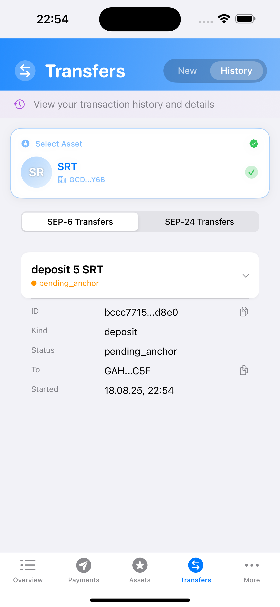

# Anchor Integration

Anchors are Stellar-specific on/off-ramps connecting the network to traditional financial systems. They enable deposits (fiat → crypto) and withdrawals (crypto → fiat) through standardized protocols. Read more in the [Stellar docs anchor section](https://developers.stellar.org/docs/learn/fundamentals/anchors).

## Supported Protocols

SwiftBasicPay integrates multiple Stellar Ecosystem Proposals (SEPs):

- **[SEP-1](https://github.com/stellar/stellar-protocol/blob/master/ecosystem/sep-0001.md)**: Stellar TOML for anchor information
- **[SEP-10](https://github.com/stellar/stellar-protocol/blob/master/ecosystem/sep-0010.md)**: Stellar Web Authentication
- **[SEP-6](https://github.com/stellar/stellar-protocol/blob/master/ecosystem/sep-0006.md)**: Deposit and Withdrawal API
- **[SEP-9](https://github.com/stellar/stellar-protocol/blob/master/ecosystem/sep-0009.md)**: Standard KYC Fields
- **[SEP-12](https://github.com/stellar/stellar-protocol/blob/master/ecosystem/sep-0012.md)**: KYC API
- **[SEP-24](https://github.com/stellar/stellar-protocol/blob/master/ecosystem/sep-0024.md)**: Hosted Deposit and Withdrawal

## Transfers Architecture

The [`TransfersView`](https://github.com/Soneso/SwiftBasicPay/blob/main/SwiftBasicPay/View/TransfersView.swift) manages anchor operations:


```swift
@Observable
class TransfersViewModel {
    // State management
    enum ViewState: Equatable {
        case initial
        case loading(message: String)
        case pinRequired
        case transferReady
        case error(String)
    }
    
    enum TransferMode: Int, CaseIterable {
        case newTransfer = 1
        case history = 2
        
        var title: String {
            switch self {
            case .newTransfer: return "New"
            case .history: return "History"
            }
        }
    }
    
    // Observable properties
    var mode: TransferMode = .newTransfer
    var state: ViewState = .initial
    var selectedAssetInfo: AnchoredAssetInfo?
    var pin = ""
    var pinError: String?
    
    // Transfer data
    var sep10AuthToken: AuthToken?
    var tomlInfo: TomlInfo?
    var sep6Info: Sep6Info?
    var sep24Info: Sep24Info?
    
    // Anchored assets
    var anchoredAssets: [AnchoredAssetInfo] = []
}
```

## Finding Anchored Assets

Assets with anchors are identified by their `home_domain`:

```swift
public static func getAnchoredAssets(
    fromAssets: [AssetInfo]
) async throws -> [AnchoredAssetInfo] {
    var anchoredAssets: [AnchoredAssetInfo] = []
    let stellar = wallet.stellar
    
    for assetInfo in fromAssets {
        let asset = assetInfo.asset
        var anchorDomain: String?
        
        // We are only interested in issued assets (not XLM)
        if let issuedAsset = asset as? IssuedAssetId {
            let issuerExists = try await stellar.account.accountExists(
                accountAddress: issuedAsset.issuer
            )
            if !issuerExists {
                continue
            }
            
            // Check if it's a known stellar testanchor asset
            if testAnchorAssets.contains(where: {
                $0.code == issuedAsset.code && 
                $0.issuer == issuedAsset.issuer
            }) {
                anchorDomain = testAnchorDomain
            } else {
                // Otherwise load from home domain (maybe it is an anchor...)
                let issuerAccountInfo = try await stellar.account.getInfo(
                    accountAddress: issuedAsset.issuer
                )
                if let homeDomain = issuerAccountInfo.homeDomain {
                    anchorDomain = homeDomain
                }
            }
            
            if let domain = anchorDomain {
                let info = AnchoredAssetInfo(
                    asset: issuedAsset,
                    balance: assetInfo.balance,
                    anchor: wallet.anchor(homeDomain: domain)
                )
                anchoredAssets.append(info)
            }
        }
    }
    
    return anchoredAssets
}
```


## SEP-1: Loading Anchor Information

The stellar.toml file provides anchor configuration:

```swift
@MainActor
private func checkWebAuth(anchor: stellar_wallet_sdk.Anchor) async {
    state = .loading(message: "Loading anchor configuration")
    tomlInfo = nil
    
    do {
        tomlInfo = try await anchor.sep1
    } catch {
        state = .error("Could not load anchor data: \(error.localizedDescription)")
        return
    }
    
    guard tomlInfo?.webAuthEndpoint != nil else {
        state = .error("The anchor does not provide authentication service (SEP-10)")
        return
    }
    
    state = .pinRequired
}
```

## SEP-10: Web Authentication

Authenticating with the anchor using Stellar account:


```swift
@MainActor
func authenticateWithPin() async {
    let feedback = UINotificationFeedbackGenerator()
    
    guard !pin.isEmpty else {
        pinError = "Please enter your PIN"
        feedback.notificationOccurred(.error)
        return
    }
    
    state = .loading(message: "Authenticating with anchor")
    pinError = nil
    
    var userKeyPair: SigningKeyPair?
    do {
        let authService = AuthService()
        userKeyPair = try authService.userKeyPair(pin: pin)
    } catch {
        pinError = error.localizedDescription
        state = .pinRequired
        feedback.notificationOccurred(.error)
        return
    }
    
    pin = ""
    
    guard let selectedAsset = selectedAssetInfo else {
        resetState()
        state = .error("Please select an asset")
        return
    }
    
    let anchor = selectedAsset.anchor
    do {
        let sep10 = try await anchor.sep10
        sep10AuthToken = try await sep10.authenticate(userKeyPair: userKeyPair!)
    } catch {
        pinError = error.localizedDescription
        state = .pinRequired
        feedback.notificationOccurred(.error)
        return
    }
    
    // Load SEP-6 & SEP-24 info
    await loadTransferInfo()
}
```

## Loading Transfer Information

After authentication, load available transfer options:

```swift
@MainActor
private func loadTransferInfo() async {
    sep6Info = nil
    sep24Info = nil
    
    state = .loading(message: "Loading transfer services")
    
    let sep6Supported = tomlInfo?.transferServer != nil
    let sep24Supported = tomlInfo?.transferServerSep24 != nil
    
    guard sep6Supported || sep24Supported else {
        state = .error("The anchor does not support SEP-6 or SEP-24 transfers")
        return
    }
    
    var errorMessages: [String] = []
    
    if sep6Supported {
        do {
            sep6Info = try await selectedAssetInfo?.anchor.sep6.info(authToken: sep10AuthToken)
        } catch {
            errorMessages.append("SEP-6: \(error.localizedDescription)")
        }
    }
    
    if sep24Supported {
        do {
            sep24Info = try await selectedAssetInfo?.anchor.sep24.info
        } catch {
            errorMessages.append("SEP-24: \(error.localizedDescription)")
        }
    }
    
    if !errorMessages.isEmpty && sep6Info == nil && sep24Info == nil {
        state = .error(errorMessages.joined(separator: "\n"))
    } else {
        state = .transferReady
        let feedback = UINotificationFeedbackGenerator()
        feedback.notificationOccurred(.success)
    }
}
```

## New Transfer View

The [`NewTransferView`](https://github.com/Soneso/SwiftBasicPay/blob/main/SwiftBasicPay/View/NewTransferView.swift) displays transfer options:


```swift
struct NewTransferView: View {
    private var assetInfo: AnchoredAssetInfo
    private var authToken: AuthToken
    private var sep6Info: Sep6Info?
    private var sep24Info: Sep24Info?
    private var savedKycData: [KycEntry]
    
    internal init(assetInfo: AnchoredAssetInfo,
                  authToken: AuthToken,
                  sep6Info: Sep6Info? = nil,
                  sep24Info: Sep24Info? = nil,
                  savedKycData: [KycEntry] = []) {
        self.assetInfo = assetInfo
        self.authToken = authToken
        self.sep6Info = sep6Info
        self.sep24Info = sep24Info
        self.savedKycData = savedKycData
    }
    
    var body: some View {
        ScrollView {
            VStack(spacing: 24) {
                if sep6Info != nil {
                    sep6TransferCard
                }
                
                if sep24Info != nil {
                    sep24TransferCard
                }
            }
        }
    }
}
```

## SEP-6 Deposit


The deposit process using SEP-6:

```swift
private var sep6TransferCard: some View {
    VStack(alignment: .leading, spacing: 16) {
        // Section header
        HStack {
            Image(systemName: "6.circle.fill")
                .font(.title2)
                .foregroundStyle(.blue)
            
            VStack(alignment: .leading, spacing: 2) {
                Text("SEP-6 Transfers")
                    .font(.headline)
                Text("Traditional transfer protocol")
                    .font(.caption)
                    .foregroundStyle(.secondary)
            }
            
            Spacer()
            
            Image(systemName: "info.circle")
                .font(.caption)
                .foregroundStyle(.secondary)
        }
        
        // Transfer buttons
        VStack(spacing: 12) {
            if let depositInfo = sep6Info?.deposit,
               let assetDepositInfo = depositInfo[assetInfo.code],
               assetDepositInfo.enabled {
                
                Button(action: {
                    showSep6DepositSheet = true
                }) {
                    transferButton(
                        title: "Deposit",
                        icon: "arrow.down.circle.fill",
                        color: .green,
                        isHovered: hoveredButton == "sep6-deposit"
                    )
                }
                .buttonStyle(PlainButtonStyle())
                .onHover { hovering in
                    hoveredButton = hovering ? "sep6-deposit" : nil
                }
                .sheet(isPresented: $showSep6DepositSheet) {
                    Sep6DepositStepper(
                        anchoredAsset: assetInfo,
                        depositInfo: assetDepositInfo,
                        authToken: authToken,
                        anchorHasEnabledFeeEndpoint: sep6Info?.fee?.enabled ?? false,
                        savedKycData: savedKycData
                    )
                }
            }
        }
    }
}
```
## Transfer data

## SEP-12: KYC Integration


Managing KYC data for transfers:

```swift

```


## Fee Calculation

Fee information is loaded during the transfer process (implemented in Sep6DepositStepper and Sep6WithdrawalStepper).


## Summary


## Success Handling

After successful transfer initiation:


```swift
struct Sep6TransferResponseView: View {
    private let response: Sep6TransferResponse
    @State private var depositInstructions: [DepositInstruction] = []
    @State private var showToast = false
    @State private var toastMessage: String = ""
    @State private var copiedText: String = ""
    
    internal init(response: Sep6TransferResponse) {
        self.response = response
    }
    
    var body: some View {
        VStack(alignment: .leading, spacing: 20) {
            switch response {
            case .missingKYC(let fields):
                MissingKYCView(fields: fields)
            case .success(let successInfo):
                SuccessView(successInfo: successInfo,
                          depositInstructions: $depositInstructions)
            }
        }
        .onAppear {
            loadDepositInstructions()
        }
    }
}
```

## Transfer History


Track transfer status and history:

```swift
struct TransferHistoryView: View {
    @State private var viewModel: TransferHistoryViewModel?
    
    private let assetInfo: AnchoredAssetInfo
    private let authToken: AuthToken
    private let savedKycData: [KycEntry]
    private let dashboardData: DashboardData
    
    init(
        assetInfo: AnchoredAssetInfo,
        authToken: AuthToken,
        savedKycData: [KycEntry] = [],
        dashboardData: DashboardData
    ) {
        self.assetInfo = assetInfo
        self.authToken = authToken
        self.savedKycData = savedKycData
        self.dashboardData = dashboardData
    }
    
    var body: some View {
        VStack(spacing: 16) {
            if let vm = viewModel {
                // History mode picker and transaction list
                // Implementation details in TransferHistoryView.swift
            }
        }
        .onAppear {
            if viewModel == nil {
                viewModel = TransferHistoryViewModel(
                    assetInfo: assetInfo,
                    authToken: authToken,
                    savedKycData: savedKycData,
                    dashboardData: dashboardData
                )
            }
        }
    }
}
```

If the status is `pending_customer_info_update`, the user must upload additional KYC data by pressing the Upload button in the expanded row.


As soon as pressed, the additionally needed KYC Information is collected in a form. It is displayed via a sheet, see [Sep12KycFormSheet.swift](https://github.com/Soneso/SwiftBasicPay/blob/main/SwiftBasicPay/View/Sep12KycFormSheet.swift). 


As soon as the user fills the requested fields, and presses the submit button, the data is sent to the anchor and the status changes to `pending_anchor`:



After some time the anchor sends the tokens to the user and the balance gets updated:


## SEP-6 Withdrawal

The SEP-6 withdrawal process is similar to the deposit process. The implementation can be found in [Sep6WithdrawalStepper.swift](https://github.com/Soneso/SwiftBasicPay/blob/main/SwiftBasicPay/View/Sep6WithdrawalStepper.swift)

## SEP-24: Interactive Transfers

### Hosted Deposit/Withdrawal

SEP-24 uses web views for the transfer process:


The implementation can be found in [NewTransferView.swift](https://github.com/Soneso/SwiftBasicPay/blob/main/SwiftBasicPay/View/NewTransferView.swift)

```swift
private func initiateSep24Transfer(mode: String) async {
    await MainActor.run {
        isLoadingSep24InteractiveUrl = true
        loadingSep24InteractiveUrlErrorMessage = nil
    }
    
    do {
        let sep24 = assetInfo.anchor.sep24
        let interactiveUrl: String?
        
        if mode == "deposit" {
            let response = try await sep24.deposit(
                assetId: assetInfo.asset, 
                authToken: authToken
            )
            interactiveUrl = response.url
        } else if mode == "withdraw" {
            let response = try await sep24.withdraw(
                assetId: assetInfo.asset, 
                authToken: authToken
            )
            interactiveUrl = response.url
        } else {
            interactiveUrl = nil
        }
        
        await MainActor.run {
            if let url = interactiveUrl {
                sep24InteractiveUrl = url
                sep24OperationMode = mode
                showSep24InteractiveUrlSheet = true
            }
            isLoadingSep24InteractiveUrl = false
        }
        
    } catch {
        await MainActor.run {
            loadingSep24InteractiveUrlErrorMessage = 
                "Error requesting SEP-24 interactive url: \(error.localizedDescription)"
            isLoadingSep24InteractiveUrl = false
        }
    }
}
```

### Interactive Web View

Display the anchor's web interface to complete the SEP-24 transfer:

```swift
struct InteractiveWebViewSheet: View {
    let url: String
    let title: String
    @Binding var isPresented: Bool
    @State private var isLoading = false
    
    var body: some View {
        NavigationView {
            InteractiveWebView(url: url, isLoading: $isLoading)
                .navigationTitle(title)
                .navigationBarTitleDisplayMode(.inline)
                .toolbar {
                    ToolbarItem(placement: .navigationBarTrailing) {
                        Button("Close") {
                            isPresented = false
                        }
                    }
                }
        }
    }
}

struct InteractiveWebView: UIViewRepresentable {
    let url: String
    @Binding var isLoading: Bool
    
    func makeUIView(context: Context) -> WKWebView {
        let configuration = WKWebViewConfiguration()
        let webView = WKWebView(frame: .zero, configuration: configuration)
        webView.navigationDelegate = context.coordinator
        return webView
    }
    
    func updateUIView(_ webView: WKWebView, context: Context) {
        if let url = URL(string: url) {
            let request = URLRequest(url: url)
            webView.load(request)
        }
    }
    
    func makeCoordinator() -> Coordinator {
        Coordinator(self)
    }
    
    class Coordinator: NSObject, WKNavigationDelegate {
        let parent: InteractiveWebView
        
        init(_ parent: InteractiveWebView) {
            self.parent = parent
        }
        
        func webView(_ webView: WKWebView, didStartProvisionalNavigation navigation: WKNavigation!) {
            DispatchQueue.main.async {
                self.parent.isLoading = true
            }
        }
        
        func webView(_ webView: WKWebView, didFinish navigation: WKNavigation!) {
            DispatchQueue.main.async {
                self.parent.isLoading = false
            }
        }
    }
}
```

## Key Features

1. **Multi-Protocol Support**: SEP-6 and SEP-24 transfers
2. **Authentication**: SEP-10 web authentication
3. **KYC Management**: SEP-12 data collection
4. **Fee Transparency**: Pre-transfer fee calculation
5. **Status Tracking**: Monitor transfer progress
6. **Interactive Flows**: Web-based transfers via SEP-24
7. **Secure Storage**: KYC data encrypted locally

## Testing with Stellar Test Anchor

Use predefined test assets (SRT, USDC) from `anchor-sep-server-dev.stellar.org`:
1. Add trustline to SRT or USDC
2. Navigate to Transfers tab
3. Select the anchored asset
4. Authenticate with PIN
5. Choose deposit or withdrawal
6. Complete the transfer flow

## Production Considerations

1. **Anchor Discovery**: Implement anchor search/directory
2. **Multi-Anchor Support**: Allow multiple anchors per asset
3. **Transaction Monitoring**: WebSocket connections for updates
4. **Error Recovery**: Retry mechanisms for failed transfers
5. **Compliance**: Implement required regulatory checks
6. **User Education**: Clear explanations of transfer processes

## Next Steps

This completes the SwiftBasicPay tutorial series. You now have a comprehensive understanding of:
- Secure key management
- Stellar account operations
- Asset management and trustlines
- Payment systems (simple and path)
- Anchor integrations for fiat on/off-ramps

For more information, visit the [Stellar documentation](https://developers.stellar.org).