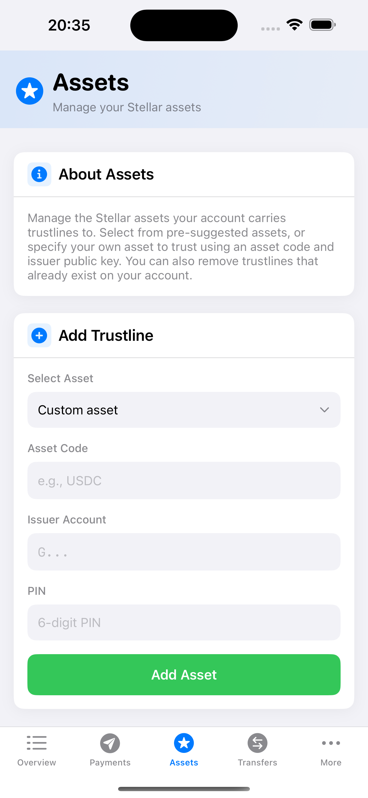
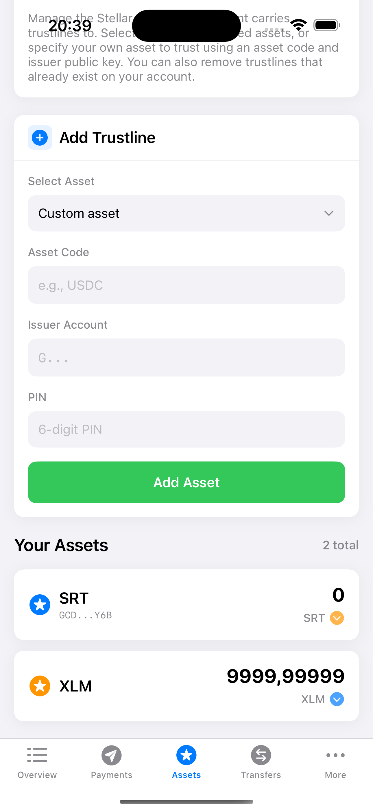

# Manage Trust

To hold and trade assets other than XLM, accounts must establish [trustlines](https://developers.stellar.org/docs/learn/fundamentals/stellar-data-structures/accounts#trustlines) with issuing accounts. Each trustline increases the account's [base reserve](https://developers.stellar.org/docs/learn/fundamentals/stellar-data-structures/accounts#base-reserves-and-subentries) by 0.5 XLM.

## Modern AssetsView Architecture

The [`AssetsView`](https://github.com/Soneso/SwiftBasicPay/blob/main/SwiftBasicPay/View/AssetsView.swift) uses iOS 17+ patterns with `@Observable` view model:



```swift
@Observable
final class AssetsViewModel {
    private let authService = AuthService()
    
    // Asset Management States
    var selectedAsset = "Custom asset"
    var assetCode = ""
    var assetIssuer = ""
    var pin = ""
    
    // Loading States
    var isAddingAsset = false
    var isRemovingAsset = false
    
    // Error Messages
    var addAssetErrorMsg: String?
    var removeAssetErrorMsg: String?
}
```

## Adding an Asset

### Asset Selection UI

Navigate to the Assets tab to see available assets:


The dropdown shows:
- Predefined Stellar Test Anchor assets (SRT, USDC)
- Custom asset option for any issued asset

```swift
struct AddAssetSection: View {
    @Binding var selectedAsset: String
    let availableAssets: [IssuedAssetId]
    
    var body: some View {
        VStack(alignment: .leading, spacing: 12) {
            Text("Select Asset")
                .font(.system(size: 13, weight: .medium))
                .foregroundColor(.secondary)
            
            Menu {
                ForEach(availableAssets, id: \.id) { asset in
                    Button(asset.code) {
                        selectedAsset = asset.id
                    }
                }
                
                Divider()
                
                Button("Custom Asset...") {
                    selectedAsset = "Custom asset"
                }
            } label: {
                HStack {
                    Text(selectedAsset)
                        .foregroundColor(.primary)
                    Spacer()
                    Image(systemName: "chevron.down")
                        .foregroundColor(.secondary)
                }
                .padding(12)
                .background(Color(.systemGray6))
                .cornerRadius(10)
            }
        }
    }
}
```

### PIN Entry for Transaction Signing


Every trustline operation requires PIN authentication:

```swift
SecureField("6-digit PIN", text: $pin)
    .keyboardType(.numberPad)
    .textFieldStyle(.plain)
    .font(.system(size: 15))
    .padding(12)
    .background(Color(.systemGray6))
    .cornerRadius(10)
    .onChange(of: pin) { _, newValue in
        // Limit to 6 digits
        if newValue.count > 6 {
            pin = String(newValue.prefix(6))
        }
        // Only allow numbers
        pin = pin.filter { $0.isNumber }
    }
```

### Adding Trustline Implementation

The async flow with proper error handling:

```swift
@MainActor
func addAsset(dashboardData: DashboardData) async {
    addAssetErrorMsg = nil
    
    guard !pin.isEmpty else {
        addAssetErrorMsg = "Please enter your PIN"
        return
    }
    
    isAddingAsset = true
    
    do {
        // Get selected or custom asset
        let assetToAdd = try await getSelectedAsset(dashboardData: dashboardData)
        
        // Decrypt signing key with PIN
        let userKeyPair = try authService.userKeyPair(pin: pin)
        
        // Add trustline using wallet SDK
        let success = try await StellarService.addAssetSupport(
            asset: assetToAdd, 
            userKeyPair: userKeyPair
        )
        
        if success {
            // Reset form
            assetCode = ""
            assetIssuer = ""
            pin = ""
            selectedAsset = "Custom asset"
            
            // Reload assets
            await dashboardData.fetchUserAssets()
            
            // Success feedback
            toastMessage = "Asset added successfully"
            showToast = true
            
            let successFeedback = UINotificationFeedbackGenerator()
            successFeedback.notificationOccurred(.success)
        }
    } catch {
        addAssetErrorMsg = error.localizedDescription
        
        let errorFeedback = UINotificationFeedbackGenerator()
        errorFeedback.notificationOccurred(.error)
    }
    
    isAddingAsset = false
}
```

### Stellar SDK Integration

Using the wallet SDK to create trustlines:

```swift
/// Adds a trust line using the wallet SDK
public static func addAssetSupport(
    asset: IssuedAssetId, 
    userKeyPair: SigningKeyPair
) async throws -> Bool {
    let stellar = wallet.stellar
    
    // Build transaction
    let txBuilder = try await stellar.transaction(sourceAddress: userKeyPair)
    let tx = try txBuilder
        .addAssetSupport(asset: asset)
        .build()
    
    // Sign with user's keypair
    stellar.sign(tx: tx, keyPair: userKeyPair)
    
    // Submit to network
    return try await stellar.submitTransaction(signedTransaction: tx)
}
```


## Adding Custom Assets

### Custom Asset Form

When "Custom asset" is selected:


```swift
if selectedAsset == "Custom asset" {
    VStack(alignment: .leading, spacing: 8) {
        Text("Asset Code")
            .font(.system(size: 13, weight: .medium))
            .foregroundColor(.secondary)
        
        TextField("e.g., USDC", text: $assetCode)
            .textFieldStyle(.plain)
            .font(.system(size: 15))
            .padding(12)
            .background(Color(.systemGray6))
            .cornerRadius(10)
            .onChange(of: assetCode) { _, newValue in
                // Limit to 12 characters (Stellar asset code limit)
                if newValue.count > 12 {
                    assetCode = String(newValue.prefix(12))
                }
            }
    }
    
    VStack(alignment: .leading, spacing: 8) {
        Text("Issuer Account")
            .font(.system(size: 13, weight: .medium))
            .foregroundColor(.secondary)
        
        TextField("G...", text: $assetIssuer)
            .textFieldStyle(.plain)
            .font(.system(size: 15, design: .monospaced))
            .padding(12)
            .background(Color(.systemGray6))
            .cornerRadius(10)
            .onChange(of: assetIssuer) { _, newValue in
                // Limit to 56 characters (Stellar address length)
                if newValue.count > 56 {
                    assetIssuer = String(newValue.prefix(56))
                }
            }
    }
}
```

### Validation and Verification

Verifying custom asset before adding:

```swift
private func getSelectedAsset(dashboardData: DashboardData) async throws -> IssuedAssetId {
    if selectedAsset == "Custom asset" {
        // Create and validate asset ID
        let selectedIssuedAsset = try IssuedAssetId(
            code: assetCode, 
            issuer: assetIssuer
        )
        
        // Verify issuer exists on network
        let issuerExists = try await StellarService.accountExists(
            address: assetIssuer
        )
        
        if !issuerExists {
            throw DemoError.runtimeError(
                "Asset issuer not found on the Stellar Network"
            )
        }
        
        return selectedIssuedAsset
    } else {
        // Return predefined asset
        let availableAssets = getAvailableAssets(dashboardData: dashboardData)
        guard let selectedIssuedAsset = availableAssets.first(where: { 
            $0.id == selectedAsset 
        }) else {
            throw DemoError.runtimeError("Error finding selected asset")
        }
        return selectedIssuedAsset
    }
}
```


## Removing Assets

### Asset Card Component

Assets display with removal capability:


```swift
struct AssetCard: View {
    let asset: AssetInfo
    let onRemove: (() -> Void)?
    @State private var isExpanded = false
    @State private var isHovered = false
    
    var canRemove: Bool {
        // Can only remove if balance is zero
        if let issuedAsset = asset.asset as? IssuedAssetId,
           Double(asset.balance) == 0 {
            return true
        }
        return false
    }
    
    var body: some View {
        VStack(spacing: 0) {
            HStack {
                // Asset icon and info
                VStack(alignment: .leading) {
                    Text(asset.code)
                        .font(.system(size: 18, weight: .semibold))
                    if let issuer = asset.issuer {
                        Text(issuer.shortAddress)
                            .font(.system(size: 11, design: .monospaced))
                            .foregroundColor(.secondary)
                    }
                }
                
                Spacer()
                
                // Balance and actions
                VStack(alignment: .trailing) {
                    Text(asset.formattedBalance)
                        .font(.system(size: 22, weight: .bold, design: .rounded))
                    
                    if canRemove {
                        Button(action: { onRemove?() }) {
                            Image(systemName: "trash")
                                .foregroundColor(.red)
                        }
                    }
                }
            }
            .padding(16)
        }
        .background(Color(.systemBackground))
        .cornerRadius(12)
        .shadow(color: Color.black.opacity(0.05), radius: 8)
    }
}
```

### Removal Confirmation Sheet


```swift
struct AssetRemovalSheet: View {
    let asset: IssuedAssetId
    @Binding var pin: String
    var error: String?
    var isLoading: Bool
    var onConfirm: () -> Void
    var onCancel: () -> Void
    
    var body: some View {
        VStack(spacing: 24) {
            Image(systemName: "exclamationmark.triangle.fill")
                .font(.system(size: 48))
                .foregroundColor(.orange)
            
            Text("Remove Trustline")
                .font(.system(size: 24, weight: .bold))
            
            VStack(spacing: 8) {
                Text("You are about to remove the trustline for:")
                    .font(.system(size: 14))
                    .foregroundColor(.secondary)
                
                Text(asset.code)
                    .font(.system(size: 18, weight: .semibold))
                
                Text(asset.issuer.shortAddress)
                    .font(.system(size: 12, design: .monospaced))
                    .foregroundColor(.secondary)
            }
            
            SecureField("Enter PIN to confirm", text: $pin)
                .keyboardType(.numberPad)
                .textFieldStyle(.plain)
                .padding(12)
                .background(Color(.systemGray6))
                .cornerRadius(10)
            
            HStack(spacing: 12) {
                Button("Cancel", action: onCancel)
                    .foregroundColor(.secondary)
                    .frame(maxWidth: .infinity)
                
                Button("Remove", action: onConfirm)
                    .foregroundColor(.white)
                    .frame(maxWidth: .infinity)
                    .padding(.vertical, 12)
                    .background(Color.red)
                    .cornerRadius(10)
                    .disabled(pin.isEmpty || isLoading)
            }
        }
        .padding(24)
    }
}
```

### Removal Implementation

```swift
@MainActor
func removeAsset(asset: IssuedAssetId, dashboardData: DashboardData) async {
    removeAssetErrorMsg = nil
    
    guard !pin.isEmpty else {
        removeAssetErrorMsg = "Please enter your PIN"
        return
    }
    
    isRemovingAsset = true
    
    do {
        // Decrypt signing key
        let userKeyPair = try authService.userKeyPair(pin: pin)
        
        // Remove trustline using wallet SDK
        let success = try await StellarService.removeAssetSupport(
            asset: asset, 
            userKeyPair: userKeyPair
        )
        
        if success {
            // Reset state
            pin = ""
            showRemovalSheet = false
            assetToRemove = nil
            
            // Reload assets
            await dashboardData.fetchUserAssets()
            
            // Success feedback
            toastMessage = "Asset removed successfully"
            showToast = true
        }
    } catch {
        removeAssetErrorMsg = error.localizedDescription
    }
    
    isRemovingAsset = false
}
```


### Stellar SDK for Removal

```swift
/// Removes a trust line using the wallet SDK
public static func removeAssetSupport(
    asset: IssuedAssetId, 
    userKeyPair: SigningKeyPair
) async throws -> Bool {
    let stellar = wallet.stellar
    
    // Build transaction
    let txBuilder = try await stellar.transaction(sourceAddress: userKeyPair)
    let tx = try txBuilder
        .removeAssetSupport(asset: asset)
        .build()
    
    // Sign and submit
    stellar.sign(tx: tx, keyPair: userKeyPair)
    return try await stellar.submitTransaction(signedTransaction: tx)
}
```

## Key Features

1. **Handling trustlines via the sdk**: add and remove trustlines to stellar assets
2. **Smart Validation**: Asset and issuer verification
3. **Error Handling**: Clear user feedback
4. **Security**: PIN required for all operations
5. **Reactive Updates**: Automatic UI refresh
6. **Haptic Feedback**: Success/error notifications

## Next

Continue with [`Payment`](payment.md).