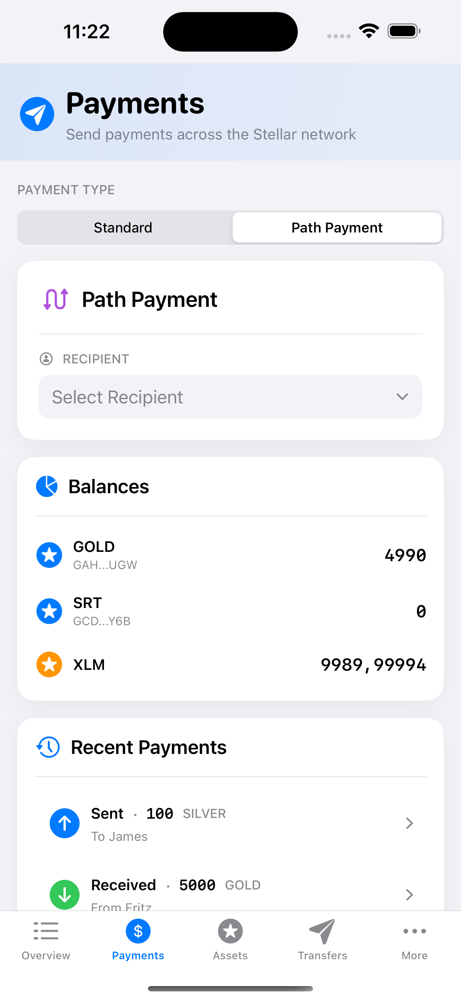

# Path Payment

Path payments enable cross-asset transactions where the asset sent differs from the asset received. Stellar supports two modes: `strict_send` (specify exact send amount) and `strict_receive` (specify exact receive amount). Read more in Stellar's [Path Payments Encyclopedia Entry](https://developers.stellar.org/docs/learn/encyclopedia/transactions-specialized/path-payments).

## Path Payment Architecture

The [`SendPathPaymentBox`](https://github.com/Soneso/SwiftBasicPay/blob/main/SwiftBasicPay/View/SendPathPaymentBox.swift) provides comprehensive path payment functionality:

```swift
@Observable
@MainActor
final class SendPathPaymentViewModel {
    // Form State
    var selectedAssetToSend = "native"
    var selectedAssetToReceive = "native"
    var strictSend = true  // true = strict send, false = strict receive
    
    // Path Finding
    var selectedPath: PaymentPath?
    var recipientAssets: [AssetInfo] = []
    
    // State Management
    enum PathPaymentState {
        case initial
        case loadingDestinationAssets
        case destinationAssetsLoaded
        case findingPath
        case pathFound
        case sendingPayment
    }
    
    var state: PathPaymentState = .initial
}
```

## Payment Mode Selection

### Strict Send vs Strict Receive


```swift
Toggle(isOn: $viewModel.strictSend) {
    HStack {
        Image(systemName: viewModel.strictSend ? "arrow.up.circle" : "arrow.down.circle")
            .foregroundColor(.blue)
        
        VStack(alignment: .leading) {
            Text(viewModel.strictSend ? "Strict Send" : "Strict Receive")
                .font(.system(size: 15, weight: .semibold))
            
            Text(viewModel.strictSend ? 
                "Specify exact amount to send" : 
                "Specify exact amount to receive")
                .font(.system(size: 12))
                .foregroundColor(.secondary)
        }
    }
}
.onChange(of: viewModel.strictSend) { _, newValue in
    viewModel.handleStrictModeChange(newValue)
}
```

## Strict Send Flow

### Selecting Asset to Send


When in strict send mode, users select from their owned assets:

```swift
if strictSend {
    Menu {
        ForEach(userAssets) { asset in
            Button(action: {
                selectedAssetToSend = asset.id
                selectedPath = nil  // Reset path when asset changes
            }) {
                HStack {
                    Text(asset.displayName)
                    Spacer()
                    Text(asset.formattedBalance)
                        .foregroundColor(.secondary)
                }
            }
        }
    } label: {
        HStack {
            Image(systemName: "star.circle")
                .foregroundColor(.orange)
            Text("Send: \(selectedAssetDisplay)")
            Spacer()
            Text(availableBalance)
                .font(.system(size: 14, design: .rounded))
                .foregroundColor(.secondary)
        }
        .padding(12)
        .background(Color(.systemGray6))
        .cornerRadius(10)
    }
}
```

## Strict Receive Flow

### Selecting Asset to Receive


In strict receive mode, users select from recipient's trusted assets:

```swift
if !strictSend {
    Menu {
        ForEach(recipientAssets) { asset in
            Button(action: {
                selectedAssetToReceive = asset.id
                selectedPath = nil
            }) {
                Text(asset.displayName)
            }
        }
    } label: {
        HStack {
            Image(systemName: "star.circle.fill")
                .foregroundColor(.green)
            Text("Receive: \(selectedAssetDisplay)")
            Spacer()
        }
        .padding(12)
        .background(Color(.systemGray6))
        .cornerRadius(10)
    }
}
```

## Loading Recipient Assets

When a recipient is selected, their trusted assets are loaded:

```swift
private func validateAndLoadRecipientAssets() async {
    state = .loadingDestinationAssets
    
    do {
        // Check if account exists
        let exists = try await StellarService.accountExists(
            address: recipientAccountId
        )
        
        if !exists {
            recipientError = "Account not found. It needs to be funded first."
            state = .otherRecipientSelected
            return
        }
        
        // Load recipient's trusted assets
        recipientAssets = try await StellarService.loadAssetsForAddress(
            address: recipientAccountId
        )
        
        state = .destinationAssetsLoaded
        
        // Set default asset to receive
        if !recipientAssets.contains(where: { $0.id == selectedAssetToReceive }) {
            selectedAssetToReceive = "native"  // Default to XLM
        }
        
        // Haptic feedback
        impactFeedback.impactOccurred()
    } catch {
        recipientError = "Failed to load recipient assets"
        state = .otherRecipientSelected
    }
}
```

## Path Finding

### Finding Payment Paths


The wallet SDK searches for available payment paths:

```swift
func findPaymentPath(userAddress: String, userAssets: [AssetInfo]) async {
    state = .findingPath
    
    do {
        var paths: [PaymentPath] = []
        
        if strictSend {
            // Find paths for strict send
            paths = try await StellarService.findStrictSendPaymentPath(
                sourceAsset: stellarAsset,
                sourceAmount: Decimal(amount),
                destinationAddress: recipientAccountId
            )
        } else {
            // Find paths for strict receive
            paths = try await StellarService.findStrictReceivePaymentPath(
                sourceAddress: userAddress,
                destinationAsset: stellarAsset,
                destinationAmount: Decimal(amount)
            )
        }
        
        if paths.isEmpty {
            pathError = "No payment path found. Try a different amount or asset."
            state = .destinationAssetsLoaded
            return
        }
        
        // Select the best path (first one for simplicity)
        selectedPath = paths.first
        state = .pathFound
        
        notificationFeedback.notificationOccurred(.success)
    } catch {
        pathError = "Failed to find path: \(error.localizedDescription)"
        state = .destinationAssetsLoaded
    }
}
```

### Stellar Service Path Finding

Using the wallet SDK for path discovery:

```swift
/// Find strict send payment paths
public static func findStrictSendPaymentPath(
    sourceAsset: StellarAssetId,
    sourceAmount: Decimal,
    destinationAddress: String
) async throws -> [PaymentPath] {
    let stellar = wallet.stellar
    
    return try await stellar.findStrictSendPathForDestinationAddress(
        destinationAddress: destinationAddress,
        sourceAssetId: sourceAsset,
        sourceAmount: sourceAmount.description
    )
}

/// Find strict receive payment paths
public static func findStrictReceivePaymentPath(
    sourceAddress: String,
    destinationAsset: StellarAssetId,
    destinationAmount: Decimal
) async throws -> [PaymentPath] {
    let stellar = wallet.stellar
    
    return try await stellar.findStrictReceivePathForSourceAddress(
        sourceAddress: sourceAddress,
        destinationAssetId: destinationAsset,
        destinationAmount: destinationAmount.description
    )
}
```

## Path Display

### Showing Found Path


Display the discovered payment path to users:

```swift
struct PathDisplayView: View {
    let path: PaymentPath
    let strictSend: Bool
    
    var body: some View {
        VStack(alignment: .leading, spacing: 16) {
            Text("Payment Path Found")
                .font(.system(size: 16, weight: .semibold))
                .foregroundColor(.green)
            
            HStack {
                VStack(alignment: .leading) {
                    Text("Send")
                        .font(.system(size: 12))
                        .foregroundColor(.secondary)
                    Text("\(path.sourceAmount) \(path.sourceAsset.displayName)")
                        .font(.system(size: 15, weight: .medium))
                }
                
                Image(systemName: "arrow.right")
                    .foregroundColor(.blue)
                
                VStack(alignment: .trailing) {
                    Text("Receive")
                        .font(.system(size: 12))
                        .foregroundColor(.secondary)
                    Text("\(path.destinationAmount) \(path.destinationAsset.displayName)")
                        .font(.system(size: 15, weight: .medium))
                }
            }
            
            if !path.path.isEmpty {
                Text("Via: \(pathDescription)")
                    .font(.system(size: 12))
                    .foregroundColor(.secondary)
            }
        }
        .padding()
        .background(Color.green.opacity(0.1))
        .cornerRadius(10)
    }
}
```

## Executing Path Payment

### Complete Path Payment Flow

```swift
func sendPathPayment(dashboardData: DashboardData) async {
    guard let path = selectedPath else {
        errorMessage = "No path selected"
        return
    }
    
    state = .sendingPayment
    
    do {
        // Get signing keypair
        let authService = AuthService()
        let userKeyPair = try authService.userKeyPair(pin: pin)
        
        // Prepare memo if provided
        let memoText = memoToSend.isEmpty ? nil : memoToSend
        
        // Execute path payment based on mode
        var result = false
        
        if strictSend {
            result = try await StellarService.strictSendPayment(
                sendAssetId: path.sourceAsset,
                sendAmount: Decimal(Double(path.sourceAmount)!),
                destinationAddress: recipientAccountId,
                destinationAssetId: path.destinationAsset,
                destinationMinAmount: Decimal(Double(path.destinationAmount)!),
                path: path.path,
                memo: memoText,
                userKeyPair: userKeyPair
            )
        } else {
            result = try await StellarService.strictReceivePayment(
                sendAssetId: path.sourceAsset,
                sendMaxAmount: Decimal(Double(path.sourceAmount)!),
                destinationAddress: recipientAccountId,
                destinationAssetId: path.destinationAsset,
                destinationAmount: Decimal(Double(path.destinationAmount)!),
                path: path.path,
                memo: memoText,
                userKeyPair: userKeyPair
            )
        }
        
        if result {
            // Success handling
            toastMessage = "Path payment sent successfully!"
            showSuccessToast = true
            notificationFeedback.notificationOccurred(.success)
            
            // Reset and refresh
            resetForm()
            await dashboardData.fetchStellarData()
        }
    } catch {
        errorMessage = error.localizedDescription
        state = .pathFound
    }
}
```

### Stellar SDK Path Payment Operations

```swift
/// Execute strict send path payment
public static func strictSendPayment(
    sendAssetId: StellarAssetId,
    sendAmount: Decimal,
    destinationAddress: String,
    destinationAssetId: StellarAssetId,
    destinationMinAmount: Decimal,
    path: [StellarAssetId],
    memo: String? = nil,
    userKeyPair: SigningKeyPair
) async throws -> Bool {
    let stellar = wallet.stellar
    
    // Build transaction
    var txBuilder = try await stellar.transaction(sourceAddress: userKeyPair)
    
    // Add strict send operation
    txBuilder = txBuilder.strictSend(
        sendAssetId: sendAssetId,
        sendAmount: sendAmount,
        destinationAddress: destinationAddress,
        destinationAssetId: destinationAssetId,
        destinationMinAmount: destinationMinAmount,
        path: path
    )
    
    // Add memo if provided
    if let memo = memo {
        let memoObj = try Memo(text: memo)
        txBuilder = txBuilder.setMemo(memo: memoObj)
    }
    
    // Build, sign, and submit
    let tx = try txBuilder.build()
    stellar.sign(tx: tx, keyPair: userKeyPair)
    return try await stellar.submitTransaction(signedTransaction: tx)
}
```

## Test Data Setup

For testing path payments, you need:

1. **Multiple Assets**: User and recipient must trust different assets
2. **Order Book Offers**: Market makers providing liquidity
3. **Trading Pairs**: Connected assets through intermediate assets

Example setup:
```
User trusts: GOLD
Recipient trusts: SILVER
Market Maker 1: Trades GOLD ↔ COPPER
Market Maker 2: Trades COPPER ↔ SILVER
Path: GOLD → COPPER → SILVER
```

Detailed instructions can be found [here](path_payment_test_setup.md).

## Recent Path Payments Display



Path payments appear in the recent payments list:

```swift
struct PathPaymentRow: View {
    let payment: PaymentInfo
    
    var body: some View {
        HStack {
            VStack(alignment: .leading) {
                HStack {
                    Text("Path Payment")
                        .font(.system(size: 14, weight: .medium))
                    
                    Image(systemName: "arrow.triangle.swap")
                        .font(.system(size: 12))
                        .foregroundColor(.blue)
                }
                
                Text("\(payment.sourceAsset) → \(payment.destinationAsset)")
                    .font(.system(size: 12))
                    .foregroundColor(.secondary)
            }
            
            Spacer()
            
            VStack(alignment: .trailing) {
                Text(payment.formattedAmount)
                    .font(.system(size: 16, weight: .semibold))
                
                Text(payment.formattedDate)
                    .font(.system(size: 11))
                    .foregroundColor(.secondary)
            }
        }
    }
}
```

## Key Features

1. **Dual Mode Support**: Strict send and strict receive
2. **Automatic Path Finding**: SDK discovers optimal routes
3. **Recipient Asset Loading**: Shows what recipient can receive
4. **Path Visualization**: Clear display of conversion path
5. **Real-time Validation**: Amount and asset verification
6. **Error Recovery**: Clear messages for path finding failures

## Best Practices

1. **Liquidity Check**: Verify sufficient liquidity exists
2. **Slippage Protection**: Set appropriate min/max amounts
3. **Path Selection**: Allow users to choose from multiple paths

## Next

Continue with [`Anchor integration`](anchor_integration.md).