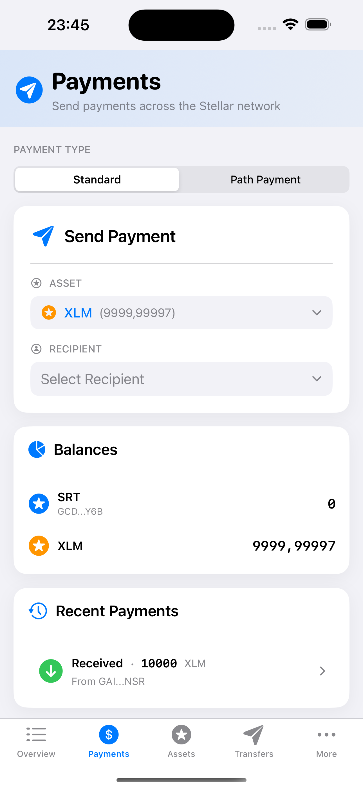

# Payment

Payment operations send assets (XLM or tokens) to destination accounts. SwiftBasicPay provides a payment interface with comprehensive validation, contact management, and real-time status updates.

## Payment Architecture

The [`PaymentsView`](https://github.com/Soneso/SwiftBasicPay/blob/main/SwiftBasicPay/View/PaymentsView.swift) uses iOS patterns with reactive state management:



```swift
@Observable
final class PaymentsViewModel {
    // UI State
    var pathPaymentMode = false
    var showSuccessToast = false
    var toastMessage = ""
    var selectedSegment = 0
    
    // Haptic feedback generator
    private let impactFeedback = UIImpactFeedbackGenerator(style: .medium)
    private let selectionFeedback = UISelectionFeedbackGenerator()
    
    func segmentChanged(to value: Int) {
        selectionFeedback.selectionChanged()
        selectedSegment = value
        pathPaymentMode = value == 1
    }
}
```

## Payment Type Selection

Users can choose between standard and path payments:

```swift
private var paymentTypeSelector: some View {
    VStack(alignment: .leading, spacing: 12) {
        Text("Payment Type")
            .font(.system(size: 12, weight: .medium))
            .foregroundColor(.secondary)
            .textCase(.uppercase)
        
        Picker("Payment Type", selection: $viewModel.selectedSegment) {
            Label("Standard", systemImage: "arrow.right.circle")
                .tag(0)
            Label("Path Payment", systemImage: "arrow.triangle.swap")
                .tag(1)
        }
        .pickerStyle(.segmented)
        .onChange(of: viewModel.selectedSegment) { _, newValue in
            viewModel.segmentChanged(to: newValue)
        }
    }
}
```

## Send Payment Implementation

### Send Payment Card

The [`SendPaymentBox`](https://github.com/Soneso/SwiftBasicPay/blob/main/SwiftBasicPay/View/SendPaymentBox.swift) provides the payment form:

```swift
@Observable
@MainActor
final class SendPaymentViewModel {
    // Form State
    var selectedAsset = "native"
    var selectedRecipient = "Select"
    var recipientAccountId = ""
    var pin = ""
    var amountToSend = ""
    var memoToSend = ""
    
    // Validation State
    var recipientError: String?
    var amountError: String?
    var pinError: String?
    
    // Loading State
    var isSendingPayment = false
}
```

### Recipient Selection

Users can select from contacts or enter a custom address:

```swift
VStack(alignment: .leading, spacing: 8) {
    Label("Recipient", systemImage: "person.circle")
        .font(.system(size: 12, weight: .medium))
        .foregroundColor(.secondary)
        .textCase(.uppercase)
    
    Menu {
        ForEach(dashboardData.userContacts, id: \.id) { contact in
            Button(action: { 
                viewModel.handleRecipientSelection(contact.id) 
            }) {
                Label(contact.name, systemImage: "person.fill")
            }
        }
        
        Divider()
        
        Button(action: { 
            viewModel.handleRecipientSelection(SendPaymentViewModel.otherRecipient) 
        }) {
            Label("Other Address", systemImage: "plus.circle")
        }
    }
}
```

### Asset Selection

Display available assets with balances:

```swift
VStack(alignment: .leading, spacing: 8) {
    Label("Asset", systemImage: "star.circle")
        .font(.system(size: 12, weight: .medium))
        .foregroundColor(.secondary)
        .textCase(.uppercase)
    
    Menu {
        ForEach(dashboardData.userAssets, id: \.id) { asset in
            Button(action: { 
                viewModel.handleAssetSelection(asset.id) 
            }) {
                Label {
                    Text(asset.code)
                } icon: {
                    Image(systemName: "star.circle")
                }
            }
        }
    }
}
```

### Amount Input with Validation

Amount input with real-time validation:

```swift
private var amountField: some View {
    VStack(alignment: .leading, spacing: 8) {
        HStack {
            Label("Amount", systemImage: "number.circle")
                .font(.system(size: 12, weight: .medium))
                .foregroundColor(.secondary)
                .textCase(.uppercase)
            
            Spacer()
            
            if let asset = dashboardData.userAssets.first(where: { 
                $0.id == viewModel.selectedAsset 
            }) {
                Text("Max: \(viewModel.calculateMaxAmount(for: asset).toStringWithoutTrailingZeros)")
                    .font(.system(size: 12))
                    .foregroundColor(.secondary)
            }
        }
        
        HStack {
            TextField("0.00", text: $viewModel.amountToSend)
                .textFieldStyle(.plain)
                .font(.system(size: 20, weight: .semibold, design: .rounded))
                .keyboardType(.decimalPad)
                .focused($focusedField, equals: .amount)
                .onChange(of: viewModel.amountToSend) { oldValue, newValue in
                    if newValue != "" && Double(newValue) == nil {
                        viewModel.amountToSend = oldValue
                    }
                    viewModel.amountError = nil
                }
            
            if let asset = dashboardData.userAssets.first(where: { 
                $0.id == viewModel.selectedAsset 
            }) {
                Text(asset.code)
                    .font(.system(size: 16, weight: .medium))
                    .foregroundColor(.secondary)
            }
        }
        .padding(12)
        .background(Color(.systemGray6))
        .cornerRadius(10)
        .overlay(
            RoundedRectangle(cornerRadius: 10)
                .stroke(viewModel.amountError != nil ? Color.red : Color.clear, lineWidth: 1)
        )
        
        if let error = viewModel.amountError {
            Label(error, systemImage: "exclamationmark.circle.fill")
                .font(.system(size: 12))
                .foregroundColor(.red)
        }
    }
}
```

### Payment Validation

Comprehensive validation before submission:

```swift
func validateRecipient() -> Bool {
    recipientError = nil
    
    if recipientAccountId.isEmpty {
        recipientError = "Recipient address is required"
        return false
    }
    
    if !recipientAccountId.isValidEd25519PublicKey() {
        recipientError = "Invalid Stellar address"
        return false
    }
    
    return true
}

func validateAmount(maxAmount: Double) -> Bool {
    amountError = nil
    
    if amountToSend.isEmpty {
        amountError = "Amount is required"
        return false
    }
    
    guard let amount = Double(amountToSend) else {
        amountError = "Invalid amount format"
        return false
    }
    
    if amount <= 0 {
        amountError = "Amount must be greater than 0"
        return false
    }
    
    if amount > maxAmount {
        amountError = "Insufficient balance (max: \(maxAmount.toStringWithoutTrailingZeros))"
        return false
    }
    
    return true
}

func validatePin() -> Bool {
    pinError = nil
    
    if pin.isEmpty {
        pinError = "PIN is required"
        return false
    }
    
    if pin.count != 6 {
        pinError = "PIN must be 6 digits"
        return false
    }
    
    return true
}
```

## Stellar SDK Payment Execution

### Complete Payment Flow

Async payment implementation:

```swift
func sendPayment(userAssets: [AssetInfo], userContacts: [ContactInfo], dashboardData: DashboardData) async {
    // ...
    
    do {
        // Verify PIN and get user keypair
        let authService = AuthService()
        let userKeyPair = try authService.userKeyPair(pin: pin)
        
        // Check if destination account exists
        let destinationExists = try await StellarService.accountExists(address: recipientAccountId)
        
        // Fund destination if it doesn't exist (testnet only)
        if !destinationExists {
            try await StellarService.fundTestnetAccount(address: recipientAccountId)
        }
        
        // Verify recipient can receive the asset
        if let issuedAsset = asset.asset as? IssuedAssetId, issuedAsset.issuer != recipientAccountId {
            let recipientAssets = try await StellarService.loadAssetsForAddress(address: recipientAccountId)
            if !recipientAssets.contains(where: { $0.id == selectedAsset }) {
                errorMessage = "Recipient cannot receive \(asset.code)"
                isSendingPayment = false
                notificationFeedback.notificationOccurred(.error)
                return
            }
        }
        
        // Prepare stellar asset
        guard let stellarAssetId = asset.asset as? StellarAssetId else {
            errorMessage = "Invalid asset type"
            isSendingPayment = false
            notificationFeedback.notificationOccurred(.error)
            return
        }
        
        // Prepare memo if provided
        var memo: Memo?
        if !memoToSend.isEmpty {
            memo = try Memo(text: memoToSend)
        }
        
        // Send payment
        let result = try await StellarService.sendPayment(
            destinationAddress: recipientAccountId,
            assetId: stellarAssetId,
            amount: Decimal(Double(amountToSend)!),
            memo: memo,
            userKeyPair: userKeyPair
        )
        
        if result {
            // Success
            toastMessage = "Payment sent successfully!"
            showSuccessToast = true
            notificationFeedback.notificationOccurred(.success)
            
            // Reset form
            resetForm()
            
            // Refresh data
            await dashboardData.fetchStellarData()
        } else {
            errorMessage = "Payment failed. Please try again."
            notificationFeedback.notificationOccurred(.error)
        }
    } catch {
        errorMessage = error.localizedDescription
        notificationFeedback.notificationOccurred(.error)
    }
    
    isSendingPayment = false
}
```

### Stellar Service Integration

Using the wallet SDK in [`StellarService`](https://github.com/Soneso/SwiftBasicPay/blob/main/SwiftBasicPay/services/StellarService.swift) for payment submission:

```swift
/// Submits a payment to the Stellar Network using the wallet SDK
public static func sendPayment(
    destinationAddress: String,
    assetId: StellarAssetId,
    amount: Decimal,
    memo: Memo? = nil,
    userKeyPair: SigningKeyPair
) async throws -> Bool {
    let stellar = wallet.stellar
    
    // Build transaction
    var txBuilder = try await stellar.transaction(sourceAddress: userKeyPair)
    
    // Add payment operation
    txBuilder = try txBuilder.transfer(
        destinationAddress: destinationAddress,
        assetId: assetId,
        amount: amount
    )
    
    // Add memo if provided
    if let memo = memo {
        txBuilder = txBuilder.setMemo(memo: memo)
    }
    
    // Build, sign, and submit
    let tx = try txBuilder.build()
    stellar.sign(tx: tx, keyPair: userKeyPair)
    return try await stellar.submitTransaction(signedTransaction: tx)
}
```

## Recent Payments Display


The recent payments card (`RecentPaymentsCard`) displays the recent payments.


## Loading Recent Payments

Using the wallet SDK to fetch payment history:

```swift
/// Loads recent payments from the Stellar Network
public static func loadRecentPayments(address: String) async throws -> [PaymentInfo] {
    let server = wallet.stellar.server
    
    // Fetch payments in descending order
    let paymentsResponseEnum = await server.payments.getPayments(
        forAccount: address,
        order: Order.descending,
        limit: 5
    )
    
    switch paymentsResponseEnum {
    case .success(let page):
        var result: [PaymentInfo] = []
        
        for record in page.records {
            // Process different payment types
            if let payment = record as? PaymentOperationResponse {
                let info = try paymentInfoFromPaymentOperationResponse(
                    payment: payment,
                    address: address
                )
                result.append(info)
            } else if let payment = record as? AccountCreatedOperationResponse {
                let info = paymentInfoFromAccountCreatedOperationResponse(
                    payment: payment
                )
                result.append(info)
            } else if let payment = record as? PathPaymentStrictReceiveOperationResponse {
                let info = try paymentInfoFromPathPaymentStrictReceiveOperationResponse(
                    payment: payment,
                    address: address
                )
                result.append(info)
            } else if let payment = record as? PathPaymentStrictSendOperationResponse {
                let info = try paymentInfoFromPathPaymentStrictSendOperationResponse(
                    payment: payment,
                    address: address
                )
                result.append(info)
            }
        }
        
        return result
        
    case .failure(_):
        throw StellarServiceError.runtimeError(
            "could not load recent payments for \(address)"
        )
    }
}
```

## Key Features

1. **Contact Integration**: Select from saved contacts
2. **Real-time Validation**: Instant feedback on invalid inputs
3. **Asset Verification**: Ensures recipient can receive the asset
4. **Testnet Support**: Auto-funds unfunded accounts
5. **Memo Support**: Optional transaction memos
6. **Haptic Feedback**: Physical feedback for actions
7. **Error Recovery**: Clear error messages and retry options

## Transaction Fees

SwiftBasicPay uses the default base fee (100,000 stroops = 0.00001 XLM):

```swift
// Fee is handled automatically by the wallet SDK
let tx = try txBuilder.build() // Uses default base fee
```

For custom fees:

```swift
txBuilder = txBuilder.setBaseFee(fee: 200) // 200 stroops
```

## Next

Continue with [`Path payment`](path_payment.md).