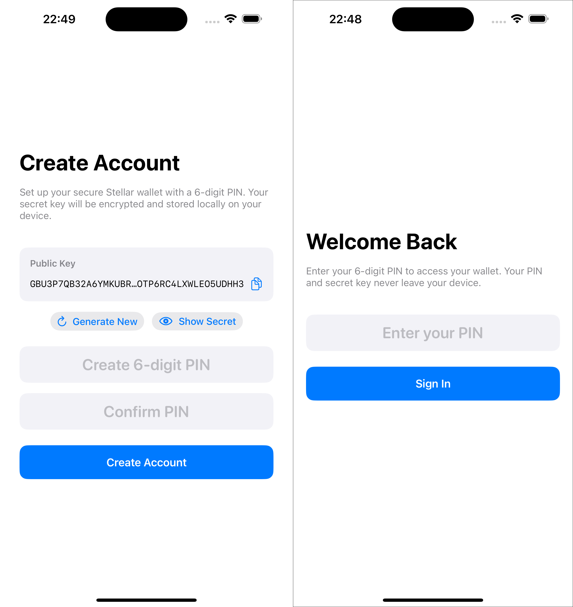
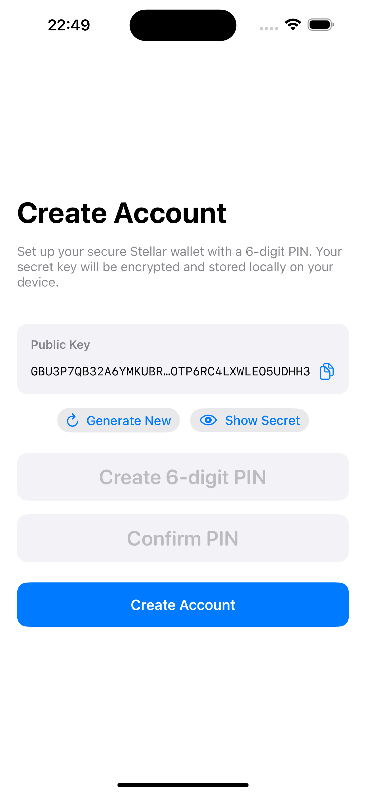
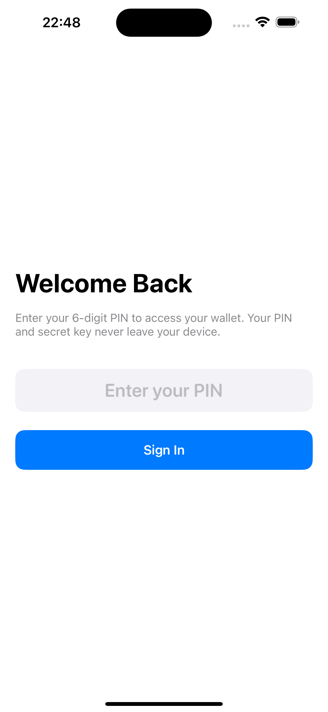

# Sign Up and Sign In

The [`AuthView`](https://github.com/Soneso/SwiftBasicPay/blob/main/SwiftBasicPay/View/AuthView.swift) manages user onboarding. It displays either the sign-up or sign-in interface based on whether a user is already registered.



## Architecture

The authentication flow uses an `@Observable` view model for state management:

```swift
@Observable
final class AuthViewModel {
    private let authService = AuthService()
    
    var hasUser: Bool = false
    var isLoading: Bool = false
    var pin: String = ""
    var pinConfirmation: String = ""
    var newUserKeypair = SigningKeyPair.random
    
    // Error states
    var signupError: String?
    var loginError: String?
    
    init() {
        checkUserStatus()
    }
}
```

## Sign Up Flow

### Account Creation

When the application starts without a registered user, [`AuthView`](https://github.com/Soneso/SwiftBasicPay/blob/main/SwiftBasicPay/View/AuthView.swift) displays the sign-up interface with a randomly generated keypair.



#### Keypair Generation

Using the stellar-wallet-sdk to generate a secure random keypair:

```swift
// Generate initial keypair on view model creation
var newUserKeypair = SigningKeyPair.random

// User can regenerate if desired
func generateNewAddress() {
    withAnimation(.spring(response: 0.3, dampingFraction: 0.8)) {
        newUserKeypair = SigningKeyPair.random
    }
}
```

#### Keypair Display Component

The UI uses reusable components for displaying keys:

```swift
struct KeyDisplayCard: View {
    let title: String
    let value: String
    let isSecret: Bool
    let onCopy: () -> Void
    
    var body: some View {
        VStack(alignment: .leading, spacing: 12) {
            Text(title)
                .font(.system(size: 14, weight: .semibold))
                .foregroundColor(.secondary)
            
            HStack {
                Text(value)
                    .font(.system(size: 14, design: .monospaced))
                    .foregroundColor(isSecret ? .red : .primary)
                    .lineLimit(isSecret ? 2 : 1)
                    .truncationMode(.middle)
                
                Button(action: onCopy) {
                    Image(systemName: "doc.on.doc")
                        .foregroundColor(.blue)
                }
            }
        }
        .padding()
        .background(RoundedRectangle(cornerRadius: 12).fill(Color(.systemGray6)))
    }
}
```

### PIN Setup

Users create a 6-digit PIN to encrypt their secret key:

```swift
struct PINInputField: View {
    @Binding var text: String
    var showError: Bool = false
    
    var body: some View {
        SecureField("Enter 6-digit PIN", text: $text)
            .keyboardType(.numberPad)
            .font(.system(size: 24, weight: .semibold, design: .rounded))
            .onChange(of: text) { oldValue, newValue in
                // Limit to 6 digits
                if newValue.count > 6 {
                    text = String(newValue.prefix(6))
                }
                // Allow only numbers
                text = text.filter { $0.isNumber }
            }
    }
}
```

### Registration Process

The async signup flow with proper error handling:

```swift
@MainActor
func signup() async -> String? {
    // Validate PIN format
    guard pin.count == 6 && pin.allSatisfy({ $0.isNumber }) else {
        signupError = "PIN must be exactly 6 digits"
        return nil
    }
    
    // Validate PIN confirmation
    guard pin == pinConfirmation else {
        signupError = "PIN and confirmation do not match"
        return nil
    }
    
    isLoading = true
    signupError = nil
    
    do {
        // Store encrypted keypair and auto-login
        let address = try authService.signUp(userKeyPair: newUserKeypair, pin: pin)
        
        // Haptic feedback on success
        let successFeedback = UINotificationFeedbackGenerator()
        successFeedback.notificationOccurred(.success)
        
        isLoading = false
        return address
    } catch {
        isLoading = false
        signupError = error.localizedDescription
        
        // Haptic feedback on error
        let errorFeedback = UINotificationFeedbackGenerator()
        errorFeedback.notificationOccurred(.error)
        
        return nil
    }
}
```

## Sign In Flow



For returning users, the sign-in interface appears:

```swift
var loginView: some View {
    VStack(spacing: 32) {
        AuthHeaderView(
            title: "Welcome Back",
            subtitle: "Enter your 6-digit PIN to access your wallet"
        )
        
        PINInputField(
            title: "6-digit PIN",
            text: $viewModel.pin,
            isFocused: focusedField == .pin
        )
        .focused($focusedField, equals: .pin)
        
        AuthButton(
            title: "Sign In",
            action: { Task { await performLogin() } },
            style: .primary,
            isLoading: viewModel.isLoading
        )
        
        if let error = viewModel.loginError {
            ErrorMessageView(message: error)
        }
    }
}
```

### Authentication Process

The login flow with PIN verification:

```swift
@MainActor
func login() async -> String? {
    // Validate PIN format
    guard pin.count == 6 && pin.allSatisfy({ $0.isNumber }) else {
        loginError = "PIN must be exactly 6 digits"
        return nil
    }
    
    isLoading = true
    loginError = nil
    
    do {
        // Verify PIN and retrieve address
        let address = try authService.signIn(pin: pin)
        
        // Success feedback
        let successFeedback = UINotificationFeedbackGenerator()
        successFeedback.notificationOccurred(.success)
        
        isLoading = false
        return address
    } catch {
        isLoading = false
        
        // Handle specific errors
        if case SecureStorageError.invalidPin = error {
            loginError = "Incorrect PIN. Please try again."
        } else {
            loginError = error.localizedDescription
        }
        
        // Error feedback
        let errorFeedback = UINotificationFeedbackGenerator()
        errorFeedback.notificationOccurred(.error)
        
        return nil
    }
}
```

## Navigation to Dashboard

After successful authentication, the user is redirected to the dashboard:

```swift
// In ContentView
struct ContentView: View {
    @State private var userAddress: String?
    
    var body: some View {
        if let userAddress = userAddress {
            // Create DashboardData
            let dashboardData = DashboardData(userAddress: userAddress)
            Dashboard(logoutUser: logoutUser)
                .environmentObject(dashboardData)
        } else {
            AuthView(userLoggedIn: { address in
                withAnimation {
                    self.userAddress = address
                }
            })
        }
    }
}
```

## Security Best Practices

- PIN is never stored, only used for encryption
- Secret key is immediately encrypted before storage
- All sensitive fields use `SecureField`

## Stellar SDK Integration

The wallet SDK provides:
- `SigningKeyPair.random`: Secure keypair generation
- `SigningKeyPair`: Validation and address derivation
- Transaction signing capabilities for authenticated users

## Next

Continue with [`Dashboard Data`](dashboard_data.md).